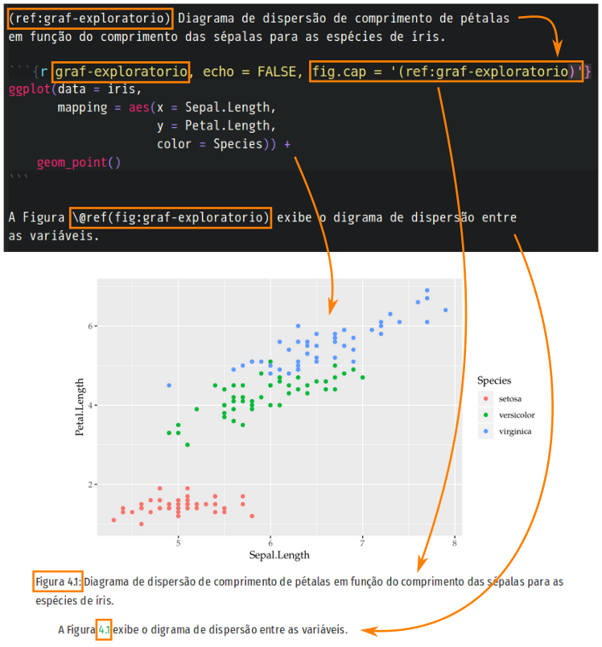
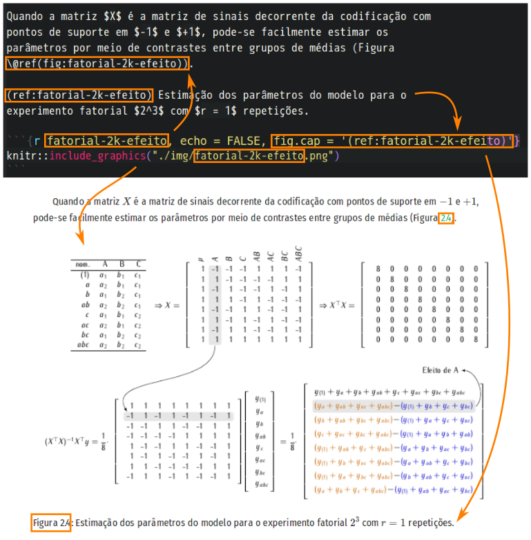
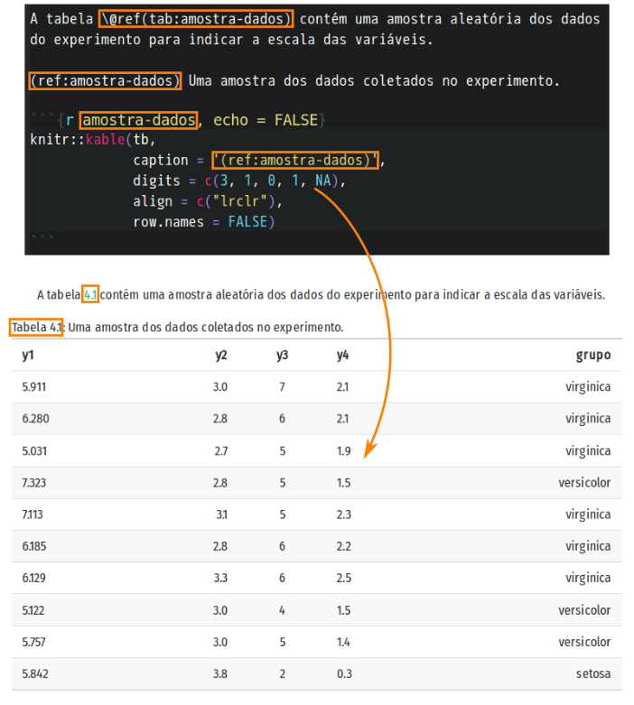
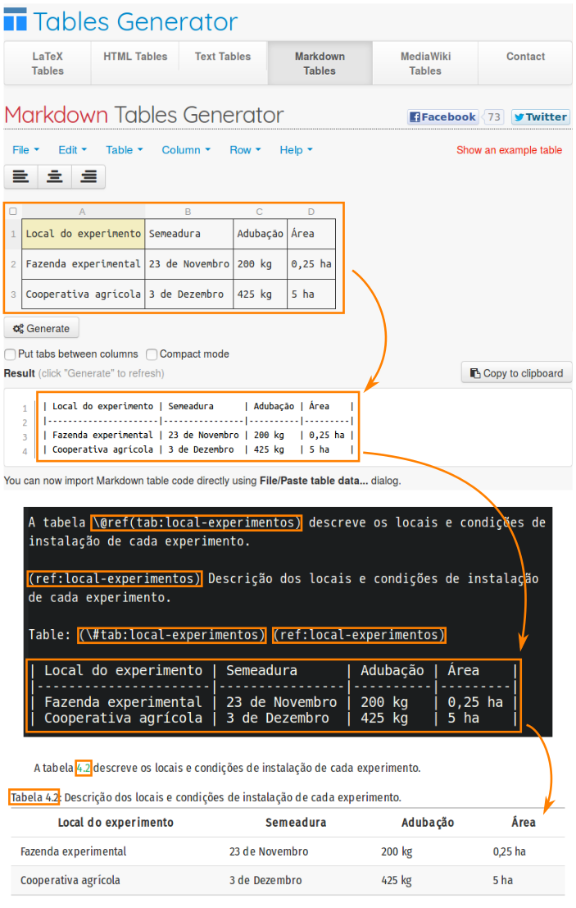
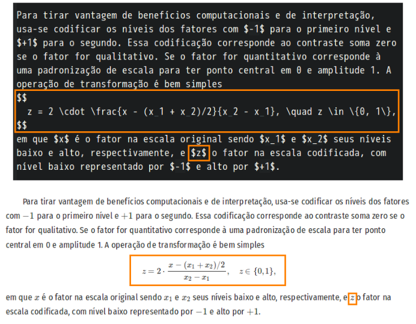
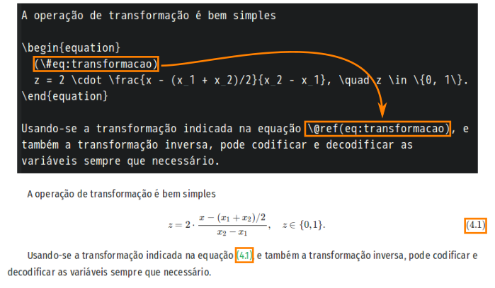
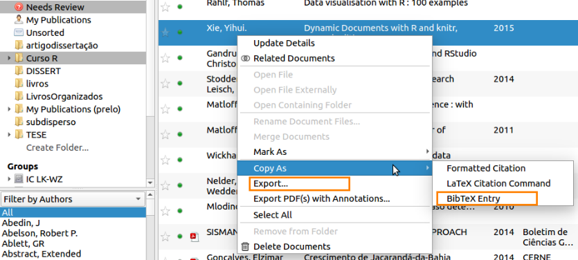
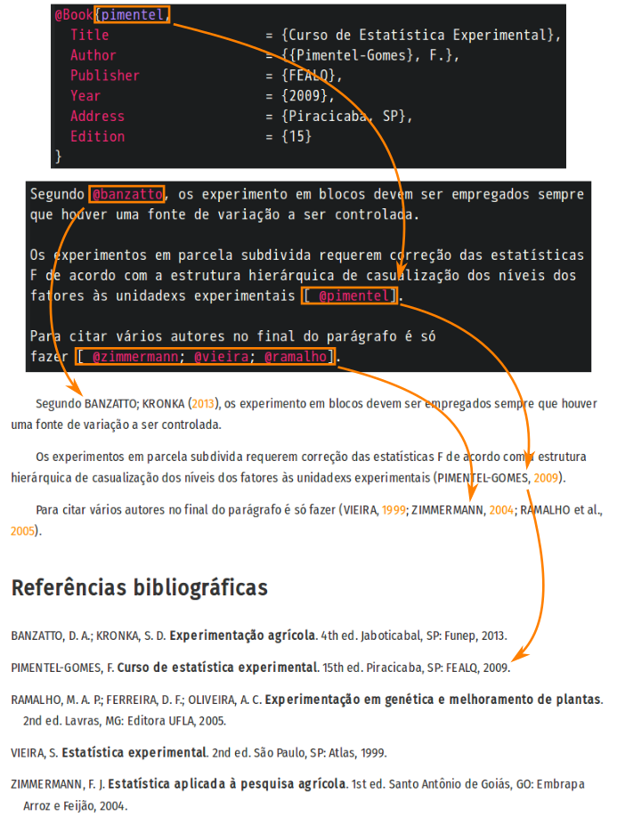

# epidemioR · Epidemiologia de Doenças de Plantas Aplicada com R

O objetivo do `epidemioR` é fazer a documentação do uso do software R no
desenvolvimento, aplicação e avaliação métodos para análise de dados em
epidemiologia para manejo de doenças em plantas com temas específicos de
interesse dos professores, pesquisadores e alunos.

Este material é produzido devido à colaboração de professores e alunos
do Programa de Pós Graduação em Produção Vegetal, com colaboração de
professores e pesquisadores externos.

## Programação das atividades

| Sem. | Data     | Atividade ( as 14 h)                                                                                                                               | Apresent.                      | Profs. / Pos-docs          |
|------|----------|----------------------------------------------------------------------------------------------------------------------------------------------------|--------------------------------|----------------------------|
| 1    | 15/08/19 | Apresentação da disciplina e demandas dos alunos                                                                                                   |                                | Larissa e Walmes           |
| 2    | 23/08/19 | Uso de ilustrações em artigos / Dados experimentos monociclo                                                                                       | Walmes / Jhulia                | Larissa e Walmes           |
| 3    | 30/08/19 | Atividade em laboratório de estatística                                                                                                            |                                | Walmes                     |
| 4    | 06/09/19 | Atividade em laboratório de estatística                                                                                                            |                                | Walmes                     |
| 5    | 13/09/19 | Dados de infecção em frutos diferentes tamanhos (sobrevivência) – 8:30 h                                                                           | Camilla                        | Larissa e Walmes           |
| 6    | 20/09/19 | Análises de mortalidade de nematoides em dose resposta                                                                                             | Marlon                         | Larissa, Walmes e Henrique |
| 7    | 27/09/19 | Atividade em laboratório de estatística                                                                                                            |                                | Walmes                     |
| 8    | 04/10/19 | Dados comparativos de espécies x fungicidas em frutos / Metodologias aplicadas para estimar EC50 em ensaios in vitro                               | Thiago / Paulo (UCDavis)       | Larissa e Walmes           |
| 9    | 11/10/19 | Atividade em laboratório de estatística                                                                                                            |                                | Walmes                     |
| 10   | 18/10/19 | Ensaios ex vivo de adaptabilidade de populações de biotróficos / Uso de diferentes parametrizações em modelos não lineares para doenças de plantas | Alexandre / Cristiano (EPAGRI) | Larissa e Walmes           |
| 11   | 25/10/19 | Atividade em laboratório de estatística                                                                                                            |                                | Walmes                     |
| 12   | 01/11/19 | Resultados de análises - Dados em R                                                                                                                | Jhulia e Camilla               | Larissa e Walmes           |
| 13   | 08/11/19 | Resultados de análises - Dados em R                                                                                                                | Marlon e Thiago e              | Larissa e Walmes           |
| 14   | 22/11/19 | Resultados de análises - Dados em R                                                                                                                | Alexandre                      | Larissa e Walmes           |
| 15   | 29/11/19 | Entrega de capítulo de livro relativo às análises                                                                                                  | TODOS                          | Larissa e Walmes           |

## Orientações para os autores

As orientações a seguir são para contribuir com a editoração do
material. Elas contém orientações de organização e sintaxe para
contrução de elementos textuais.

### Sintaxe Rmarkdown

A sintaxe markdown é amplamente documentada na web. O Rmarkdown permite
a inclusão de fragmentos de código R. Também é bem documentado na
web. Por essa razão, aqui serão apontados materiais de consulta
recomendados.

  1. <https://www.rstudio.com/wp-content/uploads/2016/03/rmarkdown-cheatsheet-2.0.pdf>.
  2. <https://www.rstudio.com/wp-content/uploads/2015/02/rmarkdown-cheatsheet.pdf>.
  3. <https://guides.github.com/pdfs/markdown-cheatsheet-online.pdf>.
  4. <https://en.support.wordpress.com/markdown-quick-reference/>.
  5. <https://bookdown.org/yihui/rmarkdown/>.
  6. <https://cran.r-project.org/web/packages/stationery/vignettes/Rmarkdown.pdf>.

### Estrutura de diretório e arquivos

Para organizar a elaboração do material de forma a garantir autonomia
para os autores e menos problemas com conflitos de edição de arquivos,
será adotada a seguinte estrutura de diretório.

```
epidemioR/
  |-- _output.yml                Arquivo de configurações.
  |-- _bookdown.yml              Arquivo de internacionalização.
  |-- index.Rmd                  Capa e configurações principais.
  |-- config/                    Diretório com arquivos de conf.
  |-- img/                       Para imagens de capa, etc.
  |
  |-- <nome-do-capitulo-1>.Rmd   Capítulo do livro.
  |-- <nome-do-capitulo-1>/      Diretório com arquivos do capítulo.
  |    |-- *.png, *.jpg, etc.    Arquivos de imagem.
  |    |-- *.txt, *.csv, etc.    Arquivos com dados em texto pleno.
  |    `-- refs.bib              Arquivo com referências bibliográficas.
  |
  |-- <nome-do-capitulo-2>.Rmd   Outro capítulo do livro.
  `-- <nome-do-capitulo-2>/      Outro diretório com arquivos.
       |-- *.png, *.jpg, etc.
       |-- *.txt, *.csv, etc.    E segue assim.
       `-- refs.bib
```

Cada capítulo será composto de um arquivo Rmarkdown (`*.Rmd`) e um
diretório onde ficarão os arquivos para o capítulo. O mesmo nome deve
ser usado para o arquivo e diretório. Por exemplo, o nome pode ser
`regressao-linear-para-cpd-em-macieira` ou
`analise-da-resistencia-a-fungicidas`. Quanto mais descritivo o nome,
melhor. Porém, usar o bom senso para o nome não ficar tão grande.

No diretório do capítulo devem ficar as imagens que serão usadas, por
exemplo, para indicar o delineamento experimental ou o estado das lesões
nos frutos. Arquivos `*.csv` ou `*.txt` contendo os dados crus devem
estar no diretório também.

O diretório deve conter um arquivo chamado `refs.bib` com as referências
bibligráficas em sintaxe bibtex. São dados mais detalhes sobre isso na
seção sobre referências bibligráficas.

No começo de cada capítulo deve se indicar os autores com o seguinte
fragmento entre o título e o primeiro parágrafo no arquivo Rmarkdown.

    ```{r, echo = FALSE, results = "asis"}
    chapter_authors(c("Walmes Marques Zeviani", "Larissa May de Mio"))
    ```

### Inclusão de figuras

A inclusão de figuras é de duas formas: i) gráficos produzidos pelo
código R e ii) imagens externas incluídas por arquivo `*.png`,
`*.jpg`, etc.

Para gráficos do R, basta criar um fragmento de código que crie o
gráfico que ele será incluído no documento final. Recomenda-se a
inclusão de uma legenda para o gráfico que é indica no parâmetro
`fig.cap` do cabeçalho de fragmento de código.

A figura a seguir indica como incluir um gráfico gerado pelo R.



A figura a seguir indica como incluir uma imagem em arquivo externo.



Atenção para duas coisas:

  1. A demarcação `(ref:<texto-unico-identicador>)` serve para passar a
     legenda para o parâmetro `fig.cap` do cabeçalho de fragmento de
     código. A legenda pode ser longa, conter representação especial
     como equações, então dessa maneira acomoda-se essas
     características.
  2. A demarcação `\@ref(<texto-unico-de-referencia>)` serve para
     identificar a figura de modo a permitir referências cruzadas no
     texto. A sugestão é que se use o nome do arquivo (sem a extensão)
     como nome de referência.

### Inclusão de tabelas

Assim como ocorre para as figuras, as tabelas colocas no texto poder sem
produzidas i) a partir do código ou ii) incluídas diretamente no texto.

Para incluir tabelas geradas a partir de *data frames* no R pode-se usar
a função `knitr::kable()`. Existem outros pacotes que também exportam
tabelas para a sintaxe *markdown*, mas este é simples de usar e atende as
necessidades. A figura abaixo indica como usá-la com os principais
parâmetros para controle de exibição da tabela.



No caso da tabela ser inserida diretamente, tem-se que colocá-la
usando-se sintaxe *markdown*. Felizmente, a tabela pode ser construída
em serviços web ou gerada a partir de arquivos CSV, por
exemplo. Consulte os links abaixo.

  1. <https://tableconvert.com/>.
  2. <https://www.tablesgenerator.com/#>.
  3. <https://www.latex-tables.com/>.
  4. <https://jakebathman.github.io/Markdown-Table-Generator/>.

Uma vez que a tabela for gerada em sintaxe *markdown* por um dos
serviços acima (ou qualquer outro equivalente), ela pode ser inserida no
texto conforme ilustra a imagem a seguir.



As mesmas formas de referência cruzada vistas para figuras estão
disponíveis para tabelas. A diferença é que o prefixo para tabela é
`tab:` e não `fig:`.

Tabelas que sejam mais complexas, por exemplo, com cédulas mescladas,
quebra de texto dentro das cédulas, podem ser feitas em outros softwares
e incluídas como imagem. O pacote
[kableExtra](https://haozhu233.github.io/kableExtra/save_kable_and_as_image.html)
tem recursos adicionais para construção de tabelas e conversão para
imagens.

### Inclusão de equações e anotações matemáticas

Equações podem ser inseridas com sintaxe LaTeX. Os links abaixo apontam
para serviços online que permitem a criação das equações em
LaTeX. Depois de prontas é só adicioná-las no texto.

  1. <https://www.codecogs.com/latex/eqneditor.php>.
  2. <https://hostmath.com/>.
  3. <https://www.latex4technics.com/>.

A imagem a seguir indica como adicionar equações que ficam centralizadas
na página (em bloco, usar `$$`) e que ficam no parágrafo (em linha, usar
`$`).



No caso de uma equação ter que ser referenciada no texto, deve-se usar
os mecanísmos de referência cruzada. A figura a seguir indica como fazer
isso. O processo é análogo ao visto para figuras e tabelas. A diferença
é que o prefixo para equações é `eq:`.



### Citação de referências bibliográficas

As referências bibliográficas são arquivadas em formato BibTeX. Para
gerar o código de uma referência em BibTeX a partir do DOI do artigo, do
ISBN do livro, do título da referência, da referência formatada, da
entrada BibTeX parcial, etc, pode-se usar um dos serviços web, softwares
ou pacotes abaixo.

  1. DOI para BibTeX: <https://www.doi2bib.org/>.
  2. DOI/ISBN/URL para Bibtex:
     <http://doi-to-bibtex-converter.herokuapp.com/> e
     <http://doi-to-bibtex.herokuapp.com/>.
  4. ISBN para BibTeX:
     <https://manas.tungare.name/software/isbn-to-bibtex>.
  5. ISBN para BibTeX: <https://www.ottobib.com/>.
  6. ISBN para BibTex: <https://www.xarg.org/tools/isbn-to-bibtex/>.
  7. Título para BibTeX: <http://www.bibme.org/bibtex/journal-citation>.
  8. Estrutura para BibTeX a partir da referência formatada:
     <https://anystyle.io/>.
  9. Serviço para preencher campos manualmente e criar BibTeX:
     <https://truben.no/latex/bibtex/>.
  10. DOI para BibTeX com Python (`urllib`):
      <https://scipython.com/blog/doi-to-bibtex/>.
  11. Completa/henriquece referências BibTeX:
      <https://github.com/nschloe/betterbib>.
  12. DOI para BibTeX com `curl` e Emacs:
      <https://tex.stackexchange.com/questions/6848/automatically-dereference-doi-to-bib>.
  13. Pacotes R:
      1. [`RefManageR`](https://cran.r-project.org/package=RefManageR):
         permite importar, manipular e fazer referências em documentos
         Rmarkdown. Tem interface para
         [CrossRef](https://www.crossref.org/) e
         [Zotero](https://www.zotero.org/). Consegue importar referência
         de PDF usando `poppler`.
      2. [`doi2bib`](https://rdrr.io/github/wkmor1/doi2bib/): usa o
         <https://www.doi2bib.org/> para importar o BibTeX.
      3. [`bib2df`](https://cran.r-project.org/web/packages/bib2df/vignettes/bib2df.html):
         Cria tabelas a partir de arquivo `*.bib`. É útil para gerar
         tabelas resumo de referências e visualizações.
  14. O software [JabRef](http://www.jabref.org/) possui recurso de
      importação por DOI, ISBN e outros identificadores únicos.

O [Mendeley](https://www.mendeley.com/) também exporta referências para
BibTeX. Selecionando várias referências, pode-se, com o botão direito do
mouse, clicar em `Export...` para criar um arquivo `*.bib` com a
coleção. Ao escolher `Copy as > BibTeX Entry`, o conteúdo em formato
BibTeX é copiado para a área de transferência, então é só colar dentro
de um arquivo já existente.



Os fragmentos de código de cada referência em BibTeX gerados devem ser
colocados em um arquivo `refs.bib` que deve ter o caminho informado no
campo `bibliography` do cabeçalho do arquivo `index.Rmd`.

```
bibliography: [<nome-do-capitulo-1>/refs.bib, <nome-do-capitulo-2>/refs.bib]
```

A figura a seguir indica a sintaxe usada para fazer as referências
diretas e entre parênteses ao final de parágrafos. A sintaxe é preceder
o nome da referência com o `@`.


