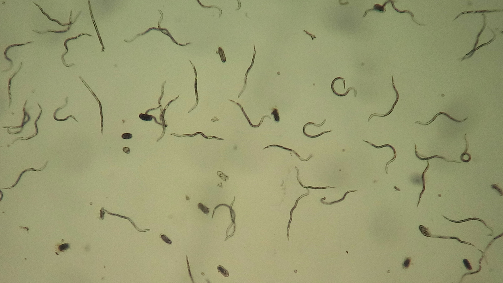
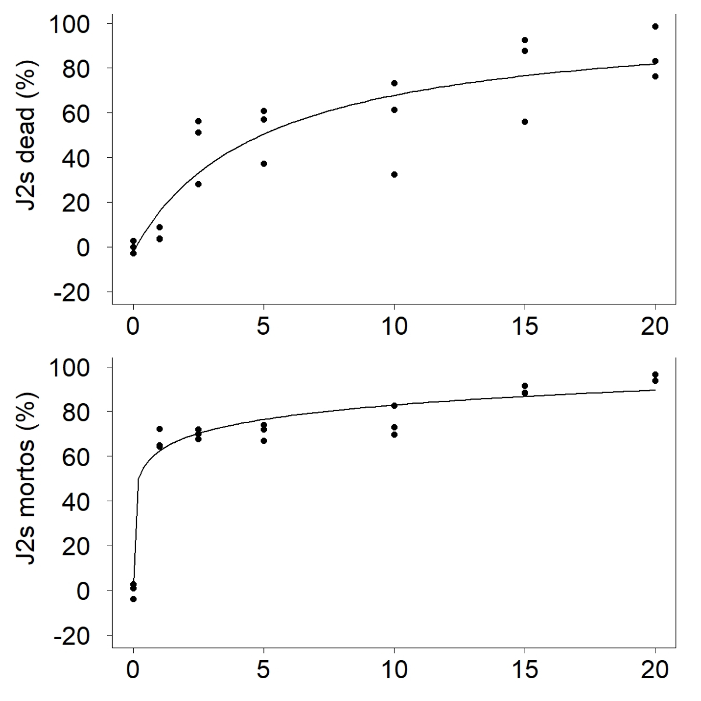

# Estudos de sensibilidade de patógenos

## Introdução

## Ensaios de sensibilidade de patógenos biotróficos - Exemplo com *Phakopsora pachyrhizi*

A soja, *Glycine max* (L.) Merr, é uma das commodities mais importantes a nível mundial, pois é fonte de óleo e proteína para alimentação humana e animal [@conab]. A produtividade dessa cultura pode ser afetada por doenças, principalmente a ferrugem asiática causada pelo fungo *P. pachyrhizi*.

O manejo da ferrugem asiática é executado principalmente com o uso de fungicidas do grupo dos inibidores de desmetilação (IDM’s), inibidores de quinona externa (IQe’s), inibidores da succinato desidrogenase (ISDH’s) e o tradicional mancozebe. Falhas no controle da ferrugem da soja tem sido observada nos últimos anos em diferentes regiões do Brasil, devido a mutações do fungo [@godoy2019].

Foi relatado mutações em isolados de *P. pachyrhizi* nos genes CYP51 [@schmitz2013], CYT-b [@klosowski2015] e SDH-c [@simoes2017]. Genótipos com resistência nos genes CYP51 e CYT-b são mais comumente encontrados [@klosowski2016] porém recentemente foi descrito a ocorrência de múltipla resistência para estes três genes no mesmo isolado [@muller].

Frequentemente, isolados resistentes a fungicidas são menos adaptados, se comparado com isolados sensíveis. Evidências experimentais sobre estudo de adaptabilidade sugerem que isso ocorre com isolados mutantes que têm resistência a fungicidas do grupo dos Qoi [@klosowski2016].

Entretanto, pouco se sabe sobre a estabilidade e adaptabilidade da mutação do gene SDH-c que confere resistência aos fungicidas do grupo SDHI. Assim como, quanto ao comportamento epidemiológico de populações de diferentes regiões do Brasil, nas diferentes condições ambientais. Desta forma, serão conduzidos ensaios visando conhecer melhor a dinâmica populacional de *P. pachyrhizi* oriundas de diferentes localidades do Brasil.

Neste trabalho será abordado análises estatisticas com o uso do R, para alguns dos componentes de adaptabilidade das populações *P. pachyrhizi* oriundas de diferentes regiões produtoras do Brasil, da qual se identificou a presença de diferentes mutações que conferem resistência a fungicidas. Será analisado os parâmetros de monociclo em plantas e folha destacada em diferentes condições de temperatura; a germinação de esporos em diferentes tempo de exposição a radiação UV; em diferentes temperaturas e incidencia luminosidade; germinacao em meio salino e quanto ao stress oxidativo das populações. Para tal se utilizou seis populações... Além disso, será analisado a EC50 de alguns grupos químicos de fungicida. Teste

(ref:image1) Escala diagramática.

```{r, image1, echo = FALSE, fig.cap = '(ref:image1)'}
# Uma imagem apenas para demarcar lugar temporariamente.
knitr::include_graphics("./config/bookcover.png")
```


## Ensaios de sensibilidade de patógenos hemibiotróficos e necrotróficos - Exemplo com *Monilinia*???


## Ensaios de sensibilidade de nematoides - Exemplo com *Meloidogyne* spp.

### Motivação

Os nematoides são animais pertencentes ao filo Nematoda, que engloba cerca de 4000 espécies. Esses animais são essencilamente aquáticos, podendo ser encontrados em todos os ecossistemas da terra. Um grupo desses animais são de extrema importância para os seres humanos, pois causam diversos prejuizos, parasitando plantas e animais. 

Na agricultura, os nematoides são extremamente importantes pois parasitam as raizes de plantas de interesse agrícola. Esse grupo de nematoides possuem em orgão destinado exclusivamente para se alimentar do protoplasto das células das plantas, o estilete. Esse orgão atua como uma agulha de uma seringa, que ao penetrar a célula vegetal, é capaz de sugar seu conteudo. Esse habito faz com que os nematoides sejam exclusivamente dependentes das plantas, toranando-os parasitas obrigatórios.

Dentre os gêneros de nematoides de importancia agricola, podemos destacar os gêneros *Meloidogyne* e *Pratylenchus*. Esses gêneros de nematoides possuem espécies capazes de parasitar as principais espécies vegetais de interesse agricola. Além disso, as espécies desses gêneros estão distrbuidas pelas diversas regiões produtoras das espécies vegetais de interesse economico.

Os nematoides do gênero *Meloidogyne* são endoparasitas e possuem a caracteristica marcante de causar galhas na raizes das plantas parasitadas. Essas galhas são causadas pela penetração do estilete dos juvenis nas células das raízes das plantas. Ao inserir o estilete, o nematoide inicia a alimentação e segrega substâncias que inibem a resposta da planta e induzem a formação do sítio de alimentação. Esse sítio de alimentação irá direcionar fotossimilados e nutrientes das células vizinhas para a célula que está sendo sugada pelo juvenil. Ao se alimentar, o juvenil se desenvolve e realiza as ecdises necessárias para seu desenvolvimento. Ao atingir o estágio adulto, a fêmea possuirá o corpo periforme (fom o formato de pêra) e produzirá uma massa de ovos que se acumula em uma matriz gelatinosa que em alguns casos poderá romper a parede da galha e ser exposta para fora das raízes da planta parasitada. Os ovos, cerca de 2000, irão iniciar um novo ciclo de parasitismo.

O gênero *Pratylenchus* abriga espécies ectoparasitas, pois são nematoides filiformes durante todas as fases de sua vida, podendo permear entre o solo e as raízes das plantas. Em todos os estágios após a eclosão do juvenil para fora o ovo, os nematoides desse gênero serão capazes de pentrar as raízes das plantas e se alimentar do conteudo das células das raizes das plantas. Esse gênero de nematoides não induz a formação do sítio de alimentação. Ao sugar o conteudo da célula, os nematoides podem movimentar-se no interior da raíz em busca de novos células. Deste modo, ao se alimentar e causar a morte das células, os nematoides desse gênero causam a necrose das raízes, rasultando em lesões que levam as raízes a morte.

```{r j2andeggs, echo = FALSE, fig.cap = '(ref:j2andeggs)'} 

```

O controle dos nematoides busca evitar as perdas economicas devido o parasitismo dos nematoides. Basicamente, após a entrada dos nematoides na área de produção agricola, atualmente não há estratégias capazes de erradicar os nematoides de maneira eficiente. Deste modo, possuimos somente estratégias que permitem conviver com os nematoides de modo a reduzir as perdas. O controle pela aplicação de algum agente de controle químico, biológico ou alternativo são amplamente realizados e estudados. 


A aplicação de substâncias para o controle de nematoides demanda de estudos do efeito da aplicação de diferentes concentrações sobre a resposta obtida. Assim, determinando o efeito de dose-resposta, é possivel estimar a concentração eficiente para obter o controle desejado. Esses estudos são realizados utilizando gradientes de concentrações de produtos, nos quais as fases de vida do nematoide são expostos ao tratamento por determinado periodo de tempo. Esses experimentos são comumente chamados de testes de eclosão, testes de motilidade e mortalidade, teste de penetração de juvenis e testes de Reprodução (Fator de reprodução).

Os testes de dose-resposta são realizados ao menos com 5 tratamentos, cada um deles com uma concentração diferente do produto. Geralmente são adicionados tratamentos testemunhas, no qual a concentração do produto testado é 0%. Cada concentração vai gerar uma resposta, afim de obter uma curva de resposta. Èssa curva deve formar um gradiente, onde as respostas apresentem diferentes níveis. Quando as concentrações não representam um gradiente de resposta, a estimativa da concentração efetiva pode ser subestima ou superestimada.

```{r curvaexemplo, echo = FALSE, fig.cap = '(ref:curvaexemplo)'} 

```

A curva de resposta corresponde a uma curva sigmoidal típica. Frequentemente os experimentos de expression(CE_50) apresentam somente parte da curva total, onde pode ocorrer ajuste em modelos lineares. A curva de dose resposta geralmente utilizada em estudos de CE50 para nematoides é baseada na curva de dose resposta baseada em um estudo de Seefeldt et al. (1995).


$$
y = f(x) = C + \frac{D - C}{1 + exp\left [ b \left ( log ( x \right ) - log\left ( CE_{50} \right ) \right )]}
$$

Onde: C é o limite inferior da curva, D é limite superior, b é o "Slup" e CE_50 é a concentração capaz de inibir em 50% a atividade dos nematoides.


### Análise de Dose-Resposta no R

Os dados obtidos pelas avaliações de um experimento preisam ser tabuladas em uma planilha. A planilha precisará ser organizada em colunas, no qual a primeira coluna corresponde ao tratamento. Na segunda coluna, devem ser dispostos as rapetições ou blocos. As colunas posteriores correspondem a variável resposta, das quais podem ser tantas quanto for necessário. A planilha poderá ser salvo em .txt, .csv ou .xlsc. Em nosso exemplo usaremos um arquivo em formato .csv. O arquivo poderá ser criado utilizando o comando de salvar como em csv (separado por ponto e vírgula). 

A importação dos dados da planilha será realizada usando os comandos abaixo:

````{r importação de dados}
# selecionar diretório onde o arquivo da planilha está salvo
setwd("D:/EC50 Nematoides")

# importar os dados para o R
tb <- read.csv2("marlon/mortalidade.csv")

# exibir os dados
head(tb)

knitr::kable(head(tb), caption = '(ref:script mortalidade)',
             digits = c(NA, 0, 0, 1, 1),
             align = c("ccccc"),
             row.names = FALSE)
```

A verificação do comportamento dos dados é importante para verificar a ocorrência de pontos fora da curva. Em nosso exemplo vamos plotar os dados em gráficos do estilo boxplot. Esse tipo de gráfico permitirá observar os dados, as médias e o desvio padrão correspondente a cada tratamento.
Os dados originais de mortalidade não serão utilizados para a estimativa de CE50. Entretanto, a verificação dos dados originais de mortalidade permitirão identificar pontos discordantes. 

```{r gráfico-exploratório-mortalidade, echo=FALSE}
# gráfico exploratório dos dados de mortalidade
knitr::kable((with(tb, boxplot(mort ~ conc, xlab="Concentração do tratamento (%)", ylab="Mortalidade de J2s (%)", 
                     ylim=c(0,100), las=1, cex.axis=0.8, horizontal = F))), caption = '(ref:gráfico-exploratório-mortalidade)',
             digits = c(NA, 0, 0, 1, 1),
             align = c("ccccc"),
             row.names = FALSE)
```

Os dados corrigidos pela equação de SCHNEIDER-ORELLI, 1947 foram expressos na planilha na coluna corr. Após a correção pela equação, a mortalidade natural da testemunha é eliminada dos dados, deste modo, os valores da testemunha após a correção são valores próximos de 0 (zero).

```{r}
# gráfico exploratório dos dadosdados de mortalidade corrigidos
knitr::kable((with(tb, boxplot(corr ~ conc, xlab="Concentração do tratamento (%)", ylab="Mortalidade de J2s (%)", 
                     ylim=c(0,100), las=1, cex.axis=0.8, horizontal = F))), caption = '(ref:gráfico-exploratório-corrigido)',
             digits = c(NA, 0, 0, 1, 1),
             align = c("ccccc"),
             row.names = FALSE)
```

O teste de Bartlett é recomendável .
Existe homogeneidade entre as variâncias?
Se P>0.05 as variâncias são homogêneas
Se P<0.05 as variâncias não são homogêneas

```{r}
bartlett.test(residuals(aov(corr ~ bloco+conc, data=mortalidade)) 
              ~ interaction(ordered(conc)), data=mortalidade)
```

```{r}
par(mfrow=c(1,1), mar=c(4,4,2,2))
qqPlot(rstudent(aov(corr ~ bloco+ordered(conc), data=mortalidade)), 
       pch=19, ylab="Resíduos")
```

Os blocos tem efeito aditivo?
Se Tukey.p>0.05 o bloco tem efeito aditivo
Se Tukey.p<0.05 o bloco não tem efeito aditivo

```{r}
require(dae)
modad<-aov(corr ~ bloco+ordered(conc) + Error(bloco), mortalidade)
tukey.1df(modad, mortalidade, error.term= "Within")
```

Transformação dos dados
```{r}
require(MASS)

boxcox(aov(eclo ~ bloco+ordered(conc), data=mortalidade), lambda = seq(0, 3, l = 101))
abline(v=1,col="blue")
```

O pacote DRC (Dose-Responde Curve)

Regressão não linear de com 4 parâmetros

```{r}
require(drc)
```

Ajustando um modelo log-logístico de cinco parâmetros (f=1)
```{r}
mortalidade.m5 <- drm(corr ~ conc, data = mortalidade, fct = LL.5(fixed = c(NA, NA, NA, NA, 1)))
coef(mortalidade.m5)
# Intervalos de confiança para todos os parâmetros
confint(mortalidade.m5)
```


```{r}
# Calculando os valores de EC/ED
ec50 <- ED(mortalidade.m5, c(50))

# Obter o intervalo de confiança de 95%
ED(mortalidade.m5, c(50), interval = "delta")
```

Comparando o método delta e transformado reversamente
intervalos de confiança para valores ED
Ajustar log-logist de 5 parâmetros

```{r}
# Estimativa de corrição por dose
backfit(mortalidade.m5)
summary(mortalidade.m5)

# Gráfico dos resíduos
plot(fitted(mortalidade.m5), residuals(mortalidade.m5)) 
abline(h=0,col="red")

# Diagnóstico de modelo para modelos de dose-resposta não linear
hatvalues(mortalidade.m5)
cooks.distance(mortalidade.m5)
logLik(mortalidade.m5)
modelFit(mortalidade.m5)
```

Plotagem da curva de dose resposta

```{r}
#Plotagem da curva de dose resposta
plot(corr ~ conc, data = mortalidade, xlab = "Concentration (%)", ylab = "Inhibition of hatching (%)", 
     xlim=c(0, 0.8), ylim=c(-20, 120), las=1, log="", lwd=0, cex=1.5, cex.axis=2.8, cex.lab=2.8,
     pch=19)

# Plotando a curva de regressão ajustada
plot(mortalidade.m5, xlab = "Concentration (%)", ylab = "Inhibition of hatching (%)",
     xlim=c(0, 0.8), ylim=c(-20, 120), log="", lwd=2, cex=0, add=TRUE)
abline(v=0.345,h=50,col="blue")
# Adicionando intervalo de confiança
plot(mortalidade.m5, broken = FALSE, type="confidence", add=TRUE)

jpeg(filename = "mortalidade.jpg",
     width = 1181, height = 788, units = "px", pointsize = 12,
     quality = 75,
     bg = "white", res = NA, family = "", restoreConsole = TRUE,
     type = c("windows"))
dev.off()
dev.off()

```
@RCoreTeam2019
@Ritz2015
@Ritz2016

