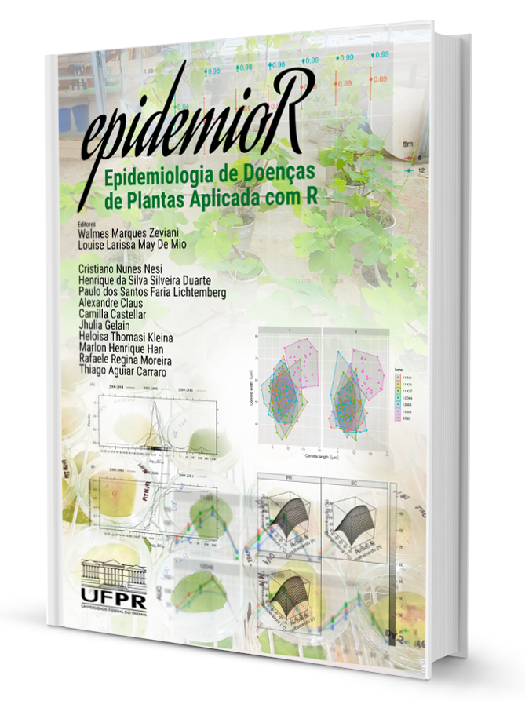

# Motivação

## Phakopsora pachyrizi

A soja, *Glycine max* (L.) Merr, é uma das commodities mais importantes a nível mundial, pois é fonte de óleo e proteína para alimentação humana e animal [@conab]. A produtividade dessa cultura pode ser afetada por doenças, principalmente a ferrugem asiática causada pelo fungo *P. pachyrhizi*.

O manejo da ferrugem asiática é executado principalmente com o uso de fungicidas do grupo dos inibidores de desmetilação (IDM’s), inibidores de quinona externa (IQe’s), inibidores da succinato desidrogenase (ISDH’s) e o tradicional mancozebe. Falhas no controle da ferrugem da soja tem sido observada nos últimos anos em diferentes regiões do Brasil, devido a mutações do fungo [@godoy2019].

Foi relatado mutações em isolados de *P. pachyrhizi* nos genes cyp51 [@schmitz2013], cytb [@klosowski2015] e sdh-c [@simoes2017]. Genótipos com resistência nos genes cyp51 e cytb são mais comumente encontrados [@klosowski2016] porém recentemente foi descrito a ocorrência de múltipla resistência para estes três genes no mesmo isolado [@muller].

Frequentemente, isolados resistentes a fungicidas são menos adaptados, se comparado com isolados sensíveis. Evidências experimentais sobre estudo de adaptabilidade sugerem que isso ocorre com isolados mutantes que têm resistência a fungicidas do grupo dos Qoi [@klosowski2016].

Entretanto, pouco se sabe sobre a estabilidade e adaptabilidade da mutação no gene SDH-c que confere resistência aos fungicidas do grupo SDHI. Assim como, quanto ao comportamento epidemiológico de populações de diferentes regiões do Brasil, nas diferentes condições ambientais. Desta forma, serão conduzidos ensaios visando conhecer melhor a dinâmica populacional de P. pachyrhizi oriundas de diferentes localidades do Brasil e, isolados destas populações.

Neste trabalho será abordado analises estatisticas com o uso do R, para alguns dos componentes de adaptabilidade das populações *P. pachyrhizi* oriundas de diferentes regiões produtoras do Brasil. Será analisado os parâmetros de monociclo em plantas e folha destacada em diferentes condições de temperatura; a germinação de esporos em diferentes tempo de exposição a radiação UV; em diferentes temperaturas e incidencia luminosidade; a germinacao em meio salino e quanto ao stress oxidativo das populacoes. Para tal se utilizou seis populações. Alem disso, será analisado a EC50 de alguns grupos quimicos de fungicida.

(ref:image1) Escala diagramática.

```{r, image1, echo = FALSE, fig.cap = '(ref:image1)'}
# Uma imagem apenas para demarcar lugar temporariamente.

```
