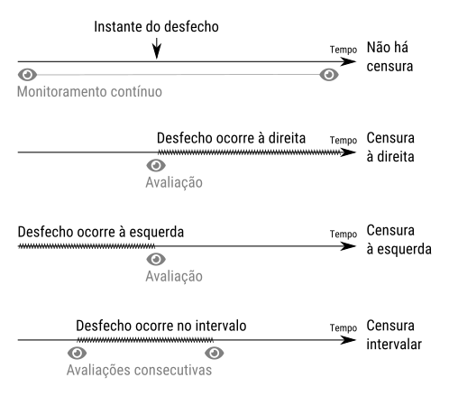
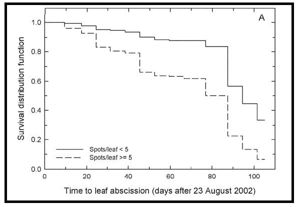
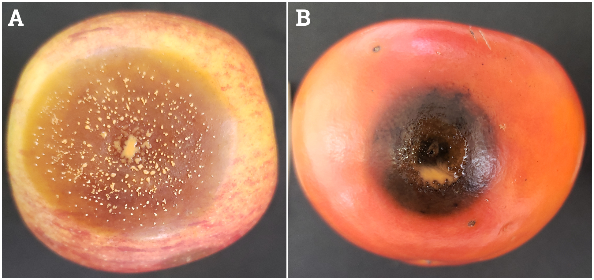
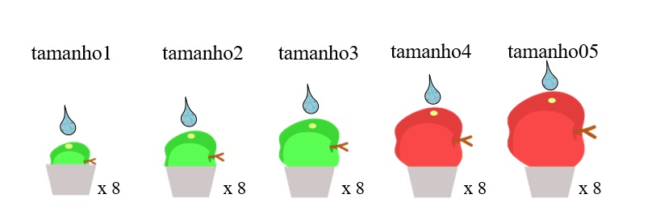

# Análise de sobrevivência

```{r, echo = FALSE, results = "asis"}
chapter_authors(c("Camilla Castellar",
                  "Walmes Marques Zeviani",
                  "Louise Larissa May De Mio"))
```

## Introdução

Experimentos em que o tempo até a ocorrência de um evento é a variável
de interesse são comuns na epidemiologia de doenças de plantas. Por
exemplo, o tempo para a ocorrência de sintomas e sinais, ou seja, o
período de incubação e latência, respectivamente, são componentes do
monociclo com grande importância para a descrição das epidemias.

Uma das principais características de dados epidemiológicos relacionados
ao tempo é a censura à direita, ou seja, o experimento pode encerrar
antes de todas as unidades experimentais apresentarem o evento. No
entanto, a análise estatística baseada na análise de variância não é
apropriada para análisar dados censurados, pois não consegue acomodar
esta característica, o que reflete em estimativas de efeitos e médias
inadequados. Dentro deste contexto, a análise de sobrevivência foi
desenvolvida com técnicas não paramétricas, semi-paramétricas e
paramétricas que consideram os tipos de censura. Alguns artigos da
fitopatologia tem sido publicados utilizando esta análise para estimar o
período de incubação [@Copes2008], comparar de cultivares utilizando o
tempo para ocorrência de sintomas, tempo para a queda de folhas
sintomáticas [@Ojiambo2005], entre outros.

O registro do tempo para ocorrência de um evento pode ser de 4 formas,
sendo que 3 delas consideram censura (Figura \@ref(fig:censuras)). O
primeiro caso não há censura pois o instante de ocorrência do evento é
registrado com exatidão, e.g. o instante em que um email spam é
recebido. O segundo caso, a censura à direita, assume-se que o desfecho
aconteceu em um instante posterior (à direita) àquele em que se fez a
avaliação, e.g. o fruto não tinha sintomas até o dia 20 no qual
encerrou-se o experimento mas certamente irá apresentar o sintoma. O
terceiro caso é a censura à esquerda quando ao fazer a primeira
observação o desfecho já aconteceu (à esquerda), e.g. o fruto já
apresentava sintomas da doença antes da inoculação da mesma. O último é
a censura intervalar em que o evento ocorre entre duas avaliações
consecutivas.

(ref:censuras) Tipo de censuras em estudos que consideram o tempo para a
ocorrência de um desfecho. Fonte: os autores.

```{r censuras, echo = FALSE, fig.cap = '(ref:censuras)'}

```

Dentre as técnicas não paramétricas, o estimador Kaplan-Meier
[@Kaplan1958] é o mais utilizado. O método estima a função de
sobrevivência, ou seja, a probabilidade de um indivíduo não apresentar o
evento decorrido um tempo $t$. Os gráficos gerados por esta análise são
representados por degraus de tempo em que ocorre o evento (Figura
\@ref(fig:curvaskaplan)). Por meio desta técnica, torna-se possível a
aplicação de testes de significância, como o Log-Rank, para comparar
tratamentos. O log-Rank testa a hipótese nula de que as curvas de
sobrevivência são iguais [@Colosimo2006]. Este tipo de técnica é
limitada em testar o efeito de apenas uma fonte de variação. Em outras
palavras, o método não permite analisar possíveis interações em
experimentos fatoriais ou mesmo acomodar termos estruturais do
delineamento, como o efeito de blocos.

(ref:curvaskaplan) Exemplo de curva de Kaplan-Meier estimando funções de
sobrevivência para a queda de folhas de mirtilo com mancha foliar de
Septoria. Fonte: [@Ojiambo2005].

```{r curvaskaplan, echo = FALSE, fig.cap = '(ref:curvaskaplan)'}

```

Na abordagem paramétrica, uma distribuição de probabilidades é
considerada sendo as distribuições Weilbull, Log-normal e exponencial as
mais utilizadas na análise de sobreviência. Esta abordagem pode ser
aplicada tanto em estudos com apenas um fator, como também permite, em
experimentos em esquema fatorial, determinar parâmetros importantes para
analisar inteirações entre fatores [@Zhang2016].

Dessa forma, este capítulo tem como objetivo ilustrar o uso coordenado
dos recursos do R para aplicar a análise de sobrevivência em dois
estudos de caso que envolvem experimentos com frutos destacados (*ex
vivo*) com podridões de frutos ocasionadas por espécies do gênero
*Colletotrichum*. No primeiro caso, a técnica não paramétrica e
paramétrica serão discutidas para um experimento epidemiológico com
maças com apenas um fator. No segundo caso, a técnica paramétrica
utilizando a distribuição de Weibull será aplicada para analisar um
experimento fatorial para o período de incubação da doença em caquis
inoculados com diferentes espécies do patógeno e tratados com diferentes
fungicidas.

(ref:frutos) Lesões necróticas e esporulação do patógeno
*Colletotrichum* spp. em frutos de maça (A) e caqui (B). Fotos: Thiago
de Aguiar Carraro

```{r frutos, echo = FALSE, fig.cap = '(ref:frutos)'}

```

## Estudo de caso 1 - Técnica não paramétrica e paramétrica em experimento com um fator

Frutos em diferentes estágios de crescimento podem apresentar diferenças
na suscetibilidade a doenças [@Jiang2014; @Keske2011]. Conhecer o
período de maior suscetibilidade pode auxiliar na tomada de decisão para
aplicações de produtos para o controle da doença. Experimentos para
avaliar a suscetibilidade podem ser realizados no campo, monitorando a
incidência de doenças em diferentes fases, ou até mesmo pela inoculação
em frutos ensacados e a observação do desenvolvimento de sintomas. Para
melhor segurança nos resultados, reduzindo o número de variáveis que
possam interferir no experimento, estudos em ambientes controlados podem
ser realizados. Este estudo de caso foi realizado em frutos destacados e
mantidos em laboratório. A suscetibilidade foi avaliada considerando o
período de incubação dos sintomas estimados pela análise de
sobrevivência.

Para o experimento, coletou-se frutos em campo e fez-se a classificação
em cinco grupos conforme o tamanho (tam1, tam2, tam3, tam4 e tam5) para
estudar o efeito do estágio de crescimento, já que frutos maiores são
mais velhos. Os frutos foram desinfestados e um ferimento foi provocado
na região equatorial das maças. Uma gota de suspensão de conídios do
patógeno foi depositada sobre o ferimento. Após a inoculação, os frutos
foram aleatoriamente distribuidos em uma sala de incubação com condições
controladas e homogeneas, constituindo um delineamento inteiramente
casualisado com 5 tratamentos (tamanho) e 8 repetições (Figura
\@ref(fig:esquema)).

```{block2, type = "note"}
Camilla, é possível editar essa imagem? Porque o você usou "tamanho05"
com o 0 na frente da unidade e não usou esse padrão nos demais.
```

(ref:esquema) Ilustração do experimento onde frutos de 5 tamanhos são
inoculados com o patógeno sob o ferimento feito na região equatorial.

```{r esquema, echo=FALSE, fig.cap= '(ref:esquema)'}

```

Após a inoculação, cada fruto foi avaliado diariamente durante 39
dias. O dia do aparecimento de sintomas foi anotado e atribuido o status
1 aos frutos sintomáticos na tabela de registro. Nos frutos em que não
apresentaram sintomas, o status registrado foi 0 e atribuido ao dia 39
(último dia de avaliação), constituindo a censura à direita. Desta
forma, a tabela com o conjunto de dados deste estudo só conteve a data
de desfecho de cada fruto (\@ref(tab:conjuntodedados) sintomático ou a
última data de avaliação dos frutos sem sintomas. No caso de tabelas que
contenham o histórico diário dos frutos é necessário filtrar os dados
para manter apenas a data em que mudou da condição sem sintoma para com
sintoma. Para isso, consultar a próxima seção.

(ref:conjuntodedados) Conjunto de dados para análise de sobrevivência
exibindo os 10 primeiros registros. A variável `day` é o dia de
ocorrência do sintoma e a variável `status` é o indicador do tipo de
censura: 0 é censura à direita e 1 é sem censura. Como a duração do
experimento foi de 39 dias, a censura à direita foi na mesma data para
todos os frutos.

```{r conjuntodedados, echo = FALSE}
tb <- read.csv2("camilla/sobrev.csv")
knitr::kable(head(tb, n = 10),
             caption = '(ref:conjuntodedados)',
             digits = c(1, 1, 1, 1),
             align = c("cccc"),
             row.names = FALSE)
```

Na sequência, os passos para a abordagem não paramétrica serão
demonstrados. A função de sobrevivência e o teste de log-rank serão
executados. O período de incubação de frutos de diferentes tamanhos foi
obtido e comparado por meio das curvas de Kaplan-Meier.

```{r, message = FALSE}
# Carrega pacotes.
library(tidyverse)
library(emmeans)
library(multcomp)
library(survival)
library(survminer)
```

Os dados estão armazenados em um arquivo CSV contendo 3 colunas. Após a
leitura, fez o gráfico que exibe a data e o tipo de desfecho de cada
fruto para cada tamanho. A análise exploratória sugere que quanto maior
o fruto, mais curto é o tempo para aparecimento dos sintomas.

```{r, message = FALSE}
# Leitura dos dados.
dados  <-  read_csv2("./camilla/sobrev.csv", col_types = cols())
attr(dados, "spec") <- NULL
str(dados)
```

```{r}
# Tabela de frequência para o tamanho do fruto.
dados %>%
    count(tamanho)

# Análises exploratórias.
dados0 <- dados %>%
    group_by(tamanho) %>%
    arrange(day) %>%
    mutate(ord = seq_along(day)/n()) %>%
    ungroup()

# Gráfico com a linha do day de cada fruto que mostra quando o evento
# aconteceu e que tipo de desfecho.
ggplot(data = dados0,
       mapping = aes(x = day, y = ord, shape = factor(status))) +
    facet_grid(facets = tamanho ~ .) +
    geom_point() +
    geom_segment(mapping = aes(x = 0, y = ord, xend = day, yend = ord)) +
    scale_shape_manual(breaks = c(0, 1),
                     values = c(1, 19),
                     labels = c("Censura", "Sintoma")) +
    labs(shape = "Desfecho",
         x = "Dias após inoculação",
         y = "Frequência acumulada") +
    scale_x_continuous(breaks = seq(0, max(dados$day), by = 10)) +
    theme(legend.position = c(0.95, 0.05),
          legend.justification = c(1, 0))
```

Os tamanhos 1, 2 e 3 não apresentaram período de incubação amostral
pois, menos de 50% das repetições apresentaram sintomas. No caso de
poucos frutos apresentarem sintomas, recomenda-se aumentar o número de
repetições do experimento. No entanto, isso não necessariamente impede
de estimar a curva de sobrevivência e estimar o período de incubação. A
definição do período de incubação, neste caso, é o tempo necessário para
que metade dos indivíduos expostos apresentem o desfecho. Portanto, o
período de incubação é a mediana da variável aleatória tempo para a
ocorrência do desfecho.

```{block2, type = "note"}
Colocar alguma referência aqui ou dar uma breve explicação do
estimador não paramétrico da curva de sobrevivência.
```

```{r}
# Resposta com avaliações sem censura e com censura à direita no final.
s1 <- with(dados,
           Surv(time = day,
                event = status))
s1

# Resposta com avaliações com censura intervalar de 1 dia e com censura
# à direita no final.
s2 <- with(dados,
           Surv(time = day,
                time2 = day + 1,
                event = ifelse(status == 1, 3, 0),
                type = "interval"))
s2

# Curvas sobreviência de Kaplan-Meier.
fit <- survfit(s2 ~ tamanho, data = dados)
fit

# Gráfico padrão com as curvas de Kaplan-Meier.
# plot(fit)

# Gráfico com melhor visual, legenda, etc.
ggsurvplot(fit,
           data = dados,
           surv.median.line = "h")

# Aplica o teste de log-rank. Só aceita censura à direita.
logrank <- survdiff(s1 ~ tamanho, data = dados)
logrank
```
```{r, include = FALSE}
chi <- sprintf("%0.1f", logrank$chisq)
```

O teste do log-rank para testar a hipótese nula de igualdade entre as
curvas apresentou uma estatística de teste igual a `r chi` bastante
favorável ($p < 0.001$) à hipótese alternativa, ou seja, em termos
práticos existe efeito do tamanho do fruto no comportamento da variável
período de incubação.

Apesar de ser possível testar a hipótese, essa abordagem não
necessariamente irá estimar a mediana para todos os níveis, pois ocorreu
alta proporção de censura em alguns tamanhos de fruto. Como pode ser
visto na saída da `survfit()`, apenas os tamanhos 4 e 5 tiveram
estimativa de mediana, porém sem o intervalo de confiança completo.

A abordagem não paramétrica, conforme visto aqui, é mais recomendada
quando o número de unidades experimentais por tratamento for grande e a
porporção de censura for baixa. A censura pode ser mitigada aumentando o
tempo de avaliação do experimento para que se observe o desfecho em mais
unidades experimentais.

Os passos para a abordagem paramétrica são relacionados a seguir. Neste
caso, o período de incubação foi obtido e comparado entre os tratamentos
por meio da estimativa do parâmetro de locação.

```{r, eval = FALSE}
# Documentação disponível no R sobre os modelos paramétricos.
help(survreg.distributions, help_type = "html")
help(dweibull, help_type = "html")

survreg.distributions$weibull
```

A função de densidade da distribuição Weibull usada na `dweibull` e
relacionadas é
$$
f(y) = \frac{a}{b} \left( \frac{y}{b} \right)^{a-1}
  \exp \left\{ -\left( \frac{y}{b} \right)^{a}\right\},
  \quad y > 0, a > 0, b > 0,
$$
em que $a$ é o parâmetro de forma (shape) e $b$ é o parâmetro de escala
(scale). Nessa parametrização, tem-se que:

  * Média: $\text{E}(Y) = b \Gamma (1 + 1/a)$.
  * Variância: $\text{Var}(Y) = b^2 (\Gamma(1 + 2/a) - (\Gamma(1 + 1/a))^2)$.
  * Função de distribuição: $F(y) = 1 - \exp\{-(x/b)^a\}$.

No entanto a parametrização usada pela `survreg()` é diferente mas
matematicamente relacionada a esta da seguinte forma
$$
\begin{align*}
  a &= 1/\lambda \quad &\Rightarrow \lambda &= 1/a \\
  b &= \exp\{\mu\} \quad &\Rightarrow \mu &= \log(b).
\end{align*}
$$

Dessa maneira, o modelo estatístico para o tempo até aparecimento de
sintoma ($Y$) pode ser escrito como
$$
\begin{align*}
  y_{ij} &= \text{Weibull}(a = 1/\lambda, b = \exp\{\mu_i\}) \\
  \mu_i &= \mu + \alpha_i \\
  \lambda &\propto 1,
\end{align*}
$$
em que $\mu_i$ acomoda o efeito do nível $i$ de tamanho no parâmetro de
escala, $\lambda$ está vinculado ao parâmetro de forma. A não rejeição
da hipótese nula $H_0: \alpha_i = 0$ para todo $i$ corresponde não haver
efeito do tamanho dos frutos.

Neste modelo, os parâmetros são estimados pelo método da máxima
verossimilhança. A função `survreg()` é portanto usada para estimar o
modelo, realizar o teste de hipótese e demais desdobramentos usuais de
análise de sobreviência.

Para fins de teste de hipótese, dois modelos serão ajustados. O modelo
inicial não contém o efeito de nunhuma fonte de variação e corresponde,
portanto, o modelo nulo ou modelo obtido sob a não rejeição da hipótese
nula $H_0: \alpha_i = 0$ para todo $i$. O modelo seguinte acomoda o
efeito de tamanho de frutos e corresponde a especificação feita acima. O
teste da razão de verossimilhanças para esses modelos testa a hipótese
nula por meio da estatística diferença de deviances.

```{block2, type = "note"}
Camilla, quando você anotou que o sintoma apareceu no dia 10, quer dizer
que ele ocorreu do dia 9 para o dia 10, certo?
```

```{r, message = FALSE}
# dados$day_orig <- dados$day
# dados$day <- log(dados$day_orig)

# Modelo nulo que não tem efeito de nenhum fator.
m0 <- survreg(formula = s2 ~ 1, data = dados, dist = "weibull")

# Inclui o efeito de tamanho do fruto.
m1 <- update(m0, formula = . ~ tamanho)

# Valores de log-verossimilhança.
c(logLik(m0), logLik(m1))

# Teste da razão de verossimilhanças entre modelos encaixados.
anova(m0, m1)
```

```{block2, type = "note"}
Para ser exato, os dados em questão apresentam censura intervalar. Por
isso, a resposta na representação do objeto `s2` é mais apropriada.
```

Conforme indicado pelo teste da razão de verossimilhanças, existe
considerável evidência à favor da rejeição da hipótese nula, ou seja, a
favor do modelo que acomoda efeito de tamanho de fruto ($p < 0.001$). Em
termos práticos, isso quer dizer que existe efeito do tamanho de fruto
no tempo de incubação. Será feito um estudo mais detalhado a seguir.

O fragmento de código abaixo tem propósito didático pois mostra como
obter o valor de log-verossimilhança do modelo ajustado. Dessa forma,
fica registrado como estão relacionadas as parametrizações da Weibull da
`dweibull()` e `survreg()` bem como a contribuição proveniente de dados
censurados e não censurados para a log-verossimilhança.

```{r}
# Avaliando a log-verossimilhança manualmente para o modelo `m0`.
a <- 1/m0$scale    # Parâmetro de forma da survreg() para a *weibull().
b <- exp(coef(m0)) # Idem pro parâmetro de escala.

# # Log-verossimilhança e suas partes.
# sum(dweibull(dados$day,        # Parte dos dados não censurados.
#              shape = a, scale = b,
#              log = TRUE) * dados$status) +
#     sum(pweibull(dados$day,    # Parte dos dados censurados à direita.
#                  shape = a, scale = b,
#                  lower.tail = FALSE, log = TRUE) * (1 - dados$status))

# Log-verossimilhança e suas partes para censura intervalar.
sum(log(pweibull(dados$day,    # Parte dos dados com censura intervalar.
                 shape = a, scale = b,
                 lower.tail = FALSE) -
        pweibull(dados$day + 1,
                 shape = a, scale = b,
                 lower.tail = FALSE)) * dados$status) +
    sum(pweibull(dados$day,    # Parte dos dados censurados à direita.
                 shape = a, scale = b,
                 lower.tail = FALSE, log = TRUE) * (1 - dados$status))
```

Para estudar com mais detalhes o efeito do tamanho do fruto, serão
determinadas as estimativas dos parâmetros para obter a curva de
probabilidade de cada nível de tamanho. Com as estimativas individuais,
comparações múltiplas de parâmetros serão realizadas para testar
hipóteses de igualdade do período de incubação entre tamanhos de frutos.

As estimativas individuais para o parâmetro de escala são facilmente
obtidas com a função `emmean::emmeans()`. Tais estimativas não são
imeditamente interpretáveis de modo que é mais interessante obter as
estimativas de média ou mediana a partir dos mesmos. Todavia, se houver
igualdade quanto ao parâmetro de escala, haverá para os demais. No
código abaixo obtem-se a estimativa de média.

```{r}
# Médias ajustadas (é na interpretação do parâmetro da Weibull).
emm <- emmeans(m1, specs = ~tamanho)
emm

# Estimativas conforme parametrização da {p, d, q, r}weibull.
tb_emm <- as.data.frame(emm)
a <- 1/m1$scale          # Shape.
b <- exp(tb_emm$emmean)  # Scale.

# Obtenção do day médio (é uma função dos dois parâmetros).
tb_emm$mean_day <- b * gamma(1 + 1/a)

# Obtenção da mediana via função predict().
tb_emm$median_day <-
    predict(m1,
            type = "quantile",
            p = 0.5,
            newdata = tb_emm[, "tamanho", drop = FALSE])
tb_emm
```

```{r, include = FALSE}
p1 <- sprintf("%0.2f", tb_emm$mean_day[5])
p2 <- sprintf("%0.2f", tb_emm$median_day[5])
```

Para os frutos de maior tamanho, o período de incubação médio é de
`r p1` dias e o período de incubação mediano é `r p2` dias. O período de
inbubação mediano corresponde à definição de período de inbubação
amostral no sentido de ser aquele para o qual metade das unidades
experimentais apresentam sintoma. Detalhe: como a distribuição Weibull é
assimétrica à direita, a mediana é por isso sempre menor que a média.

Para fazer uma contemplação visual, serão obtidas as curvas de
probabilidade acumuladas. Essas curvas descrevem a probabilidade de
apresentar o sintoma em função do tempo saindo de uma probabilidade 0 no
instante 0 até uma probabilidade limite de 1 quando o tempo vai para
infinito. Pela análise da curva é possível determinar qual o tempo
necessário para que, por exemplo, 70% dos frutos apresentem sintoma. A
mediana, no caso, é o tempo para que 50% dos frutos apresentem sintoma.

```{r}
# Obtém as curvas estimadas da função de densidade e de distribuição.
tb_curves <- tb_emm %>%
    group_by(tamanho) %>%
    do({
        day <- seq(0, max(dados$day), length.out = 71)
        dens <- dweibull(day, shape = a, scale = exp(.$emmean))
        accu <- pweibull(day, shape = a, scale = exp(.$emmean))
        data.frame(day, dens, accu)
    }) %>%
    ungroup()

# As curvas de densidade ajustadas.
# ggplot(data = tb_curves,
#        mapping = aes(x = day, y = dens)) +
#     facet_grid(facets =  ~ tamanho) +
#     geom_line()

# As curvas de "1 - sobreviência".
# ggplot(data = tb_curves,
#        mapping = aes(x = day, y = accu)) +
#     facet_grid(facets = ~ tamanho) +
#     geom_line()

# Valores observados com sobreposição das curvas ajustadas.
ggplot(data = dados0,
       mapping = aes(x = day, y = ord, shape = factor(status))) +
    facet_grid(facets = tamanho ~ .) +
    geom_point() +
    scale_shape_manual(breaks = c(0, 1),
                       values = c(1, 19),
                       labels = c("Censura", "Sintoma")) +
    labs(shape = "Desfecho",
         x = "Dias após inoculação",
         y = "Frequência acumulada") +
    # geom_vline(data = tb_emm,
    #            mapping = aes(xintercept = mean_day),
    #            color = "orange") +
    geom_line(data = tb_curves,
              inherit.aes = FALSE,
              mapping = aes(x = day, y = accu))
```

O gráfico exibe tanto os valores observados quando as curvas individuais
estimadas sobrepostas. As curvas acompanham o padrão visto nos dados, ou
seja, as curvas de menor mediana são para os tratamentos em que os
frutos apresentaram sintomas mais cedo.

```{block2, type = "note"}
**TODO**

 * Comentar que a Weibull pode não ser o melhor modelo?
 * Como acessar a qualidade do ajuste e fazer análise dos resíduos?
 * Existe envelope simulado para essa classe de modelos?
 * Ajustar o modelo ao log do tempo?
```

Com o intuito de melhor detalhar e efeito do tamanho do fruto, serão
testados os contrastes com o parâmetro de locação. Considerando todos os
contrastes par a par (contrastes de Tukey), são 10 hipóteses sob
investigação. A correção para a multiciplidade já é acomoda na
implementação disponível na função `cld()`, o que torna muito fácil a
realização de procedimentos de comparação múltipla inclusive para
modelos que não sejam gaussianos.

O fragmento de código abaixo compara, portanto, os tamanhos de fruto em
relação ao parâmetro de escala. Os resultados são exibidos de forma
gráfica para mais rápida compreensão.

```{r}
# Comparando os tratamentos.
emm_tamanho_in <- emmeans(m1, specs = ~tamanho)
# emm_tamanho_in

# contrast(emm_trat_in, method = "pairwise")
tamanho_in_comp <- multcomp::cld(emm_tamanho_in)
# tamanho_in_comp

# Tabela com o resultado das comparações múltiplas.
tb_contr <- as.data.frame(tamanho_in_comp)
# tb_contr

# Transformar os números para letras e ordenar as letras conforme as
# estimativas.
source("./funcoes.R")

# Acerta a representação da significância dos contrastes com letras.
tb_contr <- tb_contr %>%
    mutate(let = num2cld(.group)) %>%
    inner_join(tb_emm[, c("tamanho", "mean_day", "median_day")])
tb_contr
```

```{r, fig.height = 3}
ggplot(data = tb_contr,
       mapping = aes(y = tamanho, x = emmean)) +
    geom_point() +
    geom_errorbarh(mapping = aes(xmin = lower.CL,
                                 xmax = upper.CL),
                   height = 0.1) +
    geom_text(mapping = aes(label = sprintf("%0.2f %s",
                                            emmean,
                                            let)),
              vjust = -0.5,
              hjust = 0.5) +
    labs(y = "Tamanho do fruto",
         x = "Estimativa do parâmetro de locação")
```

O gráfico mostra que não existe diferença entre os tamanhos 1, 2
e 3. Para estes, a estimativa da mediana é superior a 45 dias. O tamanho
5 foi o que apresentou menor tempo para os sintomas sendo diferente de
todos exceto do tamanho 4.

## Conclusão

  1. A abordagem não paramétrica:
     * A abordagem não paramétrica é interessante por não fazer muitas
       suposições sobre o fenômedo de interesse.
     * Ela permite facilmente testar o efeito de uma fonte de variação.
     * No entanto, isso pode ser restritivo quando o experimento tiver
       mais fatores experimentais ou estruturais (e.g. blocos).
     * A abordagem não paramétrica não necessariamente irá estimar a
       mediana que é o período de incubação.
  2. A abordagem paramétrica:
     * Assume uma distribuição de probabilidade para o tempo entre
       eventos.
     * É capaz de acomodar os vários tipos de censura.
     * Permite acomodar o efeito de vários termos experimentais ou
       estruturais.
     * Permite estimar funções dos parâmetros, como média e mediana.
     * No entanto, se o modelo não for apropriado para o caso em
       questão, as inferências estatão comprometidas.
