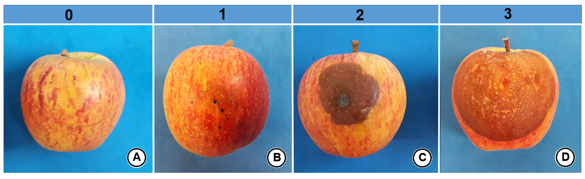

```{r, echo = FALSE, results = "asis"}
chapter_authors(c("Camilla Castellar"))
```

# Análise de sobrevivência


## Introdução 

Espécies do gênero *Colletotrichum* estão associadas a duas doenças da macieira, denominadas de mancha foliar de Glomerella (MFG) e podridão amarga (PA) [@Damm2012; @Gonzlez2006]. A MFG causa sintomas em folhas e diminutas lesões em frutos de macieira Gala, que não evoluem em tamanho, enquanto a PA desenvolve podridões que podem cobrir toda a superfície dos frutos. A relação entre os sintomas não é esclarecida [@Kat2000] e algumas das hipóteses para os dois tipos de sintomas associadas a um mesmo gênero são: o momento de infecção do patógeno, presença de ferimentos nos frutos e espécie associada.  Assim, o objetivo do trabalho foi investigar os sintomas produzidos pelo patógeno considerando as hipóteses destacadas anteriormente. 

Dois experimentos semelhantes foram realizados com as cultivares Eva e Gala. Frutos de cinco estágios fenologicos foram coletados no campo de forma aleatória e mantidos em potes com umidade. Os frutos foram inoculados com as espécies *C. nymphaeae* e *C. fructicola* em maças com e sem ferimento. O delineamento experimental foi inteiramente ao acaso em esquema de fatorial triplo, com 5 estágios fenológicos x 3 tipos de inoculação (2 espécies e a testemunha) x 2 formas de infecção (com e sem ferimento) x 4 repetições. Cada repetição foi composta por 2 frutos mantidos em um mesmo pote e o experimento foi repetido em duas áreas de coleta. As avaliações foram realizadas diariamente a partir da inoculação e o tipo de sintoma foi associado a números. O número 0 corresponde ausência de sintomas, 1 sintomas de MFG, 2 para sintomas de PA e 3 para lesões com esporulação nas lesões de PA (Figura \@ref(fig:sintomas)). 

(ref:sintomas) Frutos de macieira sem sintomas (A), com mancha foliar de glomerella em frutos (B), podridão amarga (C), lesão da podridão amarga esporulando (D) e seus números correspondentes nas avaliações. 

```{r sintomas, echo=FALSE, fig.cap= '(ref:sintomas)'}

```


