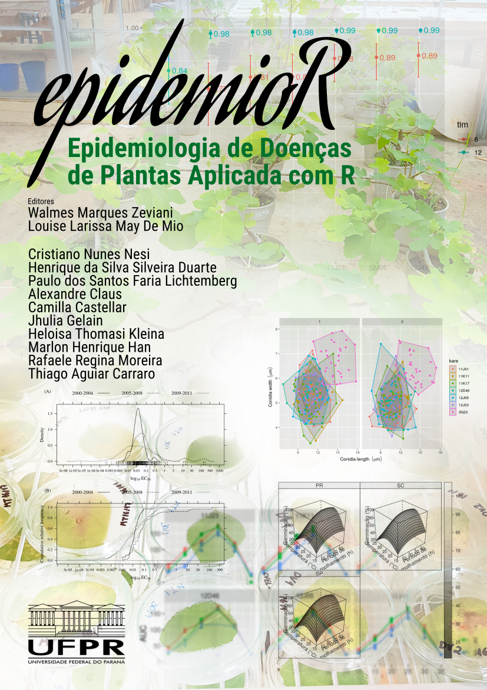

<!-- Imagem de capa. -->
```{r, echo = FALSE, results = "asis", eval = isOutput("html")}
img <- '# {-}\n\n<div></div>'
cat(img, "\n")
```

\

**Atenção**: Este material está em contínuo desenvolvimento. Sugestões,
contribuições e críticas são bem vindas. Apenas use os conjuntos de
dados disponíveis nesse material com expressa permissão dos
pesquisadores responsáveis.

# Apresentação {-}

```{r, include = FALSE, eval = isOutput("html")}
# Para habilitar Font Awesome no documento.
# https://github.com/rstudio/rmarkdown/issues/813
fa <- rmarkdown::html_dependency_font_awesome()
fa$attachment <- "fonts/fontawesome-webfont.ttf"
htmltools::tagList(fa)
```

O objetivo do `epidemioR` é fazer a documentação do uso do software R no
desenvolvimento, aplicação e avaliação métodos para análise de dados em
epidemiologia para manejo de doenças em plantas com temas específicos de
interesse dos professores, pesquisadores e alunos.

De forma geral, são vistas abordagens de análise que vão da aplicação do
R para análise de progresso temporal e espacial de doenças, estudo de
dispersão de inóculo, modelagem e previsão de epidemias, análises
multivariadas, análise de regressão múltipla e regressão não linear,
dentre outros conforme demanda. Procura-se, sem que haja distanciamento
dos objetivos da pesquisa, inovar no emprego de métodos estatísticos
para que haja melhor aproveitamento dos dados, o que se consegue
principalmente com: apropriadas visualizações gráficas, métodos de
análise contemporâneos e apropriados às características da investigação
e produção de código aberto e reproduzível.

A ênfase do curso é sobre problemas, delineamentos e abordagens de
análise comuns à área epidemiológica como aqueles com medidas repetidas
no tempo e experimentos realizados em vários anos e locais, também
àqueles que avaliem tempo até um desfecho (inoculação, esporulação),
dados de proporção (germinação, etc), dados de curva de crescimento
(modelos não lineares) e análise de dados de avaliação de doença
(incidência e severidade).

Este material é produzido devido à colaboração de professores e alunos
do Programa de Pós Graduação em Produção Vegetal, com colaboração de
professores e pesquisadores externos.
