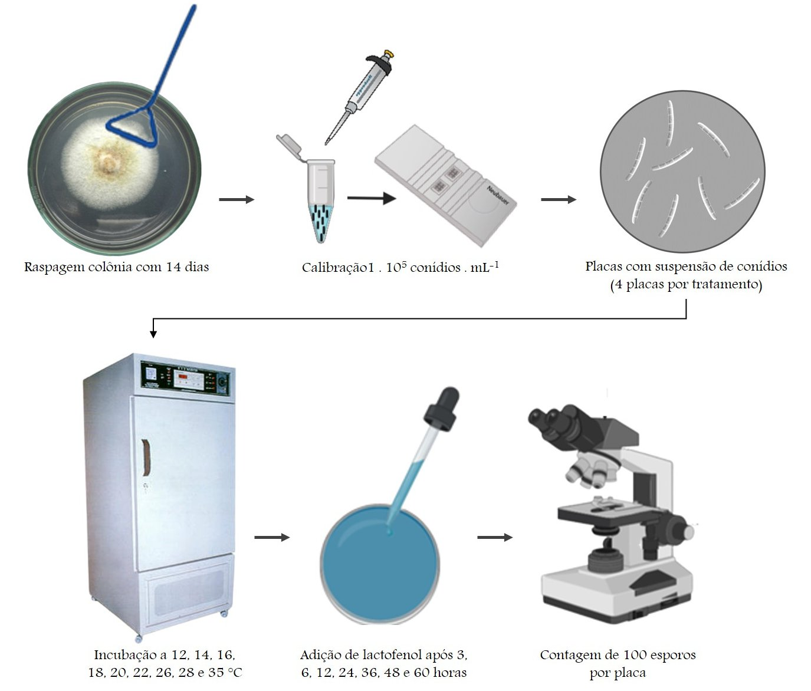
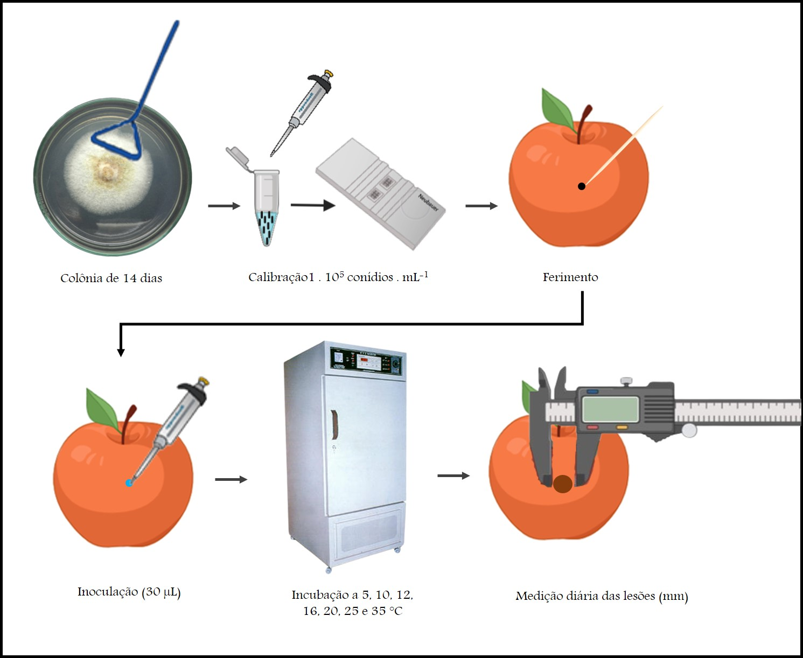

# Comparação de modelos polinomial e não-linear para experimentos de germinação de conídios fúngicos e equações para o estudo de monociclo de doenças em frutos

## Motivação

  Estudos de condições favoráveis para o desenvolvimento de patógenos como experimentos de germinação de esporos sob diferentes temperaturas e períodos de incubação são essenciais para a compreensão do comportamento da doença no campo. Outra forma interessante é estudar a doença em condições controladas é inocular o patógeno em um momento conhecido e estudar condições diferentes para o monociclo das doenças, em n variações de condições climáticas; a partir dos dados observados, realizar a modelagem do desenvolvimento das doenças por meio de equações matemáticas é útil para prever diferentes situações e entender as epidemias. A utilização de modelos consolidados na literatura auxilia na comparação de diversas variáveis relevantes por meio dos parâmetros estimados, contudo pode apresentar algumas limitações. O objetivo desse capítulo será a comparação de modelos para ajuste de dados de germinação de conídios e estudo de monociclo de doença de frutos. Exemplificaremos com dados de germinação de conídios fúngicos e Monociclo de Podridão de Neonectria em frutos, cujo agente causal é o patógeno *Neonectria ditissima*.


  Várias doenças ocorrem em regiões produtoras de maçãs (*Malus domestica* Borkh.) do mundo todo, como Europa, América do Norte, Chile, Austrália, Nova Zelândia, Japão e África do Sul [@Beresford2011]. Detectados no Brasil em 2002, o Cancro Europeu das Pomáceas e Podridão de Neonectria em frutos se destacam entre as doenças que vêm causando grandes danos na cadeia produtiva da macieira. A doença afeta os ramos e o tronco principal da planta causando sintoma de cancro, podendo também atacar frutos, causando sintomas de podridão marrom-escura, frequentemente com esporulação esbranquiçada presente nas lesões (Figura \@ref(fig:prancha01)). A podridão de Neonectria em frutos de maçã ocorre na maioria das áreas produtoras do mundo, e no Brasil sua elevada incidência pode ser explicada pelas condições climáticas mais favoráveis e/ou pela maior quantidade de inóculo nos pomares, devido à falta de experiência no manejo [@EmbrapaCancro2015].


(ref:prancha01) Sintomas de Cancro Europeu em macieira (esq.) e de podridão de Neonectria em fruto (dir.) em cultivar Gala.

```{r prancha01, echo = FALSE, fig.cap = '(ref:prancha01)'}
knitr::include_graphics("./jhulia/prancha01.jpg")
```

O fungo produz dois tipos de esporos, sendo os ascósporos produzidos sexuadamente em peritécios e os conídios produzidos assexuadamente em esporodóquios (Figura \@ref(fig:prancha02)).

(ref:prancha02) Esporodóquio produzindo conídios (esq.) e peritécios produzindo ascósporos (dir.) de *Neonectria ditissima*.

```{r prancha02, echo = FALSE, fig.cap = '(ref:prancha02)'}
knitr::include_graphics("./jhulia/prancha02.jpg")
```

  Dados sobre as taxas de germinação de conídios em diferentes temperaturas e períodos de incubação e de latência são relevantes para a predição de riscos de acordo com as condições ambientais que ocorrem no pomar. O modelo beta-monomolecular tem sido amplamente utilizado na literatura para representar o comportamento da germinação de conídios sob diferentes temperaturas e períodos de incubação ou molhamento [@Angeli2017; @Christiano2003; @Escanferla2009; @Godoy1999; @Lima2017; @MayDeMio2002; @Soares2008] e estimar diversas variáveis com aplicação biológica. Este modelo, em alguns casos, apresenta algumas limitações, que serão abordadas no tópico a seguir.

  Um outro modelo amplamente utilizado é o beta generalizado modificado, que inclui estimar não só temperatura mínima, máxima e ótima como também um parâmetro relacionado com a amplitude da curva [@Bassanezi1998]. O modelo pode ser estimado a partir de parametrização da beta-generalizada, como descrito a seguir:

Equação 1:
$$
Y(T) = \beta _1(T-T_{min})^{\beta 2} (T_{max}-T)^{\beta3}
$$
<<<<<<< HEAD
  
  A equação acima foi modificada trocando dois parâmetros por outros dois parâmetros que posuem significado biológico $T_{opt}$ e o nível na temperatura ótima $Y(T_{opt} = Y_{opt})$. Portanto, a temperatura ótima para a função beta-generalizada é dada por: 
  
=======

  A equação acima foi modificada trocando dois parâmetros por outros dois parâmetros que posuem significado biológico $T_{opt}$ e o nível na temperatura ótima $Y(T_{opt} = Y_{opt}$. Portanto, a temperatura ótima para a função beta-generalizada é dada por:

>>>>>>> 3f3e8949a42ec7a04ef55953a4a9256438c4f539
Equação 2
$$
T{opt} = (\beta _2T_{max} + \beta _3T_{min})/(\beta _2+\beta _3)
$$

  A equação acima pode ser rearranjada para trocar $\beta_2$ por $T_{opt}$:

Equação 3
$$
\beta _2 = \beta _3(T_{opt}-T_{min})/(T_{max}-T{opt})
$$

  O valor máximo $Y_{opt}$ na equação 2 ocorre em $T_{opt}$ e pode ser calculada por:

Equação 4
$$
  Y_{opt} = \beta_1\beta_2^{\beta_2}\beta_3^{\beta_3}[(T_{max}-T_{min})/(\beta_2+\beta_3)]^{\beta_2+\beta_3}
$$

  Rearranjando a equação acima para determinar $\beta_1$ em função de $\beta_2$, $\beta_3$ e $Y_{opt}$, e usando a equação 4 para substituit $\beta_2$ temos:

Equação 5
$$
  Y(T) = Y_{opt}[(T-T_{min})/(T_{opt}-T{min})]^{\beta3(T_{opt}-T_{min})/(T_{max}-T_{opt})}[(T_{max}-T)/(T_{max}-T_{opt})]^{\beta_3}
$$

  Fixando $T_{min}$ e $T_{max}$ para valores conhecidos, a equação acima contém os três parâmetros $Y_{opt}$, $T_{opt}$ e $\beta_3$. O parâmetro $\beta_3$ representa a abertura do sino, ou seja, o intervalo de temperatura a partir do ponto $T_{opt}$, no qual a curva permanece próxima a $Y_{opt}$. Para valores de $\beta_3$ baixos (por exemplo 0,1) um amplo intervalo de temperatura foi estimado; para valores altos (próximos a 3,0) a curva tem uma descida acentuada quando a temperatura difere um pouco da $T_{opt}$.

  Este modelo é muito útil para comparar epidemias e verificar a dependência de um determinado patógeno a uma condição climática [@DallaPria2003; @QuesadaMoraga2006; @Leite2002; @GarciaFernandez2008] Apesar de muito utilizados, em alguns casos não se consegue ajustes e há a necessidade da adaptação de outros modelos que melhor se adequem aos dados. Uma alternativa é a utilização de modelos polinomiais que permitem melhor ajuste devido a sua flexibilidade, mas que ainda assim se consiga estimar os parâmetros relacionados às variáveis biológicas de interesse epidemiológico.

  Embora *N. ditissima* seja mais comumente descrito como patógeno de partes lenhosas, ele também infecta frutos de maçã resultando em podridão em pré-colheita (no pomar) ou, mais comumente, em pós-colheita (armazenamento) [@Xu2010]. O uso de equações para representar o monociclo da doença em frutos sob diferentes temperaturas pode ser um recurso útil na previsão de como a doença se comportará em diferentes condições e ajudar os produtores em decisões de manejo. Estudos de monociclo envolvendo patógenos foliares serão foco de um outro capítulo deste livro (depois ligar com o item correto).

  Esse capítulo objetivou a elucidação e comparação de modelos polinomial e beta-monomolecular para avaliação de dados de germinação de esporos em diferentes temperaturas e períodos de molhamento, bem como descrever equações que descrevam o comportamento do monociclo de doenças que causam podridão em frutos. Serão descritos os passos e análises realizadas bem como o layout dos dados de forma descritiva e analisados.


## Germinação de conídios

  O experimento de germinação de conídios de *N. ditissima* foi conduzido por meio de metodologia descrita na Figura \@ref(fig:figuragerminacao).

(ref:figuragerminacao) Metodologia de ensaio de germinação de conídios de *Neonectria ditissima* em diferentes temperaturas e períodos de incubação.

```{r figuragerminacao, echo = FALSE, fig.cap = '(ref:figuragerminacao)'}

```


A Tabela \@ref(tab:germinacao-neonectria-ditissima) descreve como os dados da germinação de *Neonectria ditissima* foram tabulados.

(ref:germinacao-neonectria-ditissima) Descrição do tipo de esporo - esp (conídio), temperatura - temp (°C), período de incubação - pi (h) e germinação - ger (%).


```{r germinacao-neonectria-ditissima, echo=FALSE}
tb <- read.csv2 ("jhulia/germinacao-neonectria-ditissima.csv")
knitr::kable(head(tb), caption = '(ref:germinacao-neonectria-ditissima)',
             digits = c(NA, 0, 0, 1),
             align = c("cccc"),
             row.names = FALSE)
```

  Os tópicos a seguir testarão ajuste de modelos para ensaio que avaliou a germinação em um experimento fatorial completamente cruzado com períodos de incubação. Os dados tem efeito de bloco porque o inóculo usado no experimento foi oriundo de duas placas distintas e cada placa foi usada para temperaturas distintas e conhecidas. Blocar os dados é necessário porque o inóculo crescido em cada placa pode ter características de germinação distintas e inerentes às colônias. Serão testados polinômios e modelos não lineares para fazer o ajuste.

```{r, message=FALSE}
# Pacotes.
rm(list = objects())
library(lattice)
library(latticeExtra)
library(tidyverse)
library(directlabels)
```


```{r}
# Importação dos dados.
# setwd('C:/Users/Jhulia/Projects/repo/epidemioR/jhulia')
tb <- read_csv2("./jhulia/germinacao-neonectria-ditissima.csv",
                comment = "#")
attr(tb, "spec") <- NULL
tb
tb$bloc <- ifelse(test = is.element(tb$temp,
                                    set = c(12, 16, 20, 26, 35)),
                  yes = "inoc1",
                  no = "inoc2")
# Observação: os dados tem efeito de bloco porque o inóculo usado no
# experimento foi oriundo de duas placas distintas e cada placa foi
# usada para temperaturas distintas e conhecidas. Blocar os dados é
# necessário porque o inóculo crescido em cada placa pode ter
# características de germinação distintas e inerentes às colônias.
# O comportamento da germinação em relação à temperatura dá uma curva
# côncava com ponto de máximo no interior da região experimental. A
# germinação como função do período de molhamento sinaliza uma função
# monótona não decrescente. Na temperatura 35 não houve germinação.

# Análise exploratória.
ggplot(data = tb) +
    aes(x = temp, y = ger, color = factor(pm), shape = bloc) +
    facet_wrap(facets = ~esp, ncol = 1) +
    geom_point() +
    stat_summary(aes(shape = NULL), fun.y = "mean", geom = "line") +
    labs(x = "Temperatura",
         y = "Germinação",
         color = "Período de\nmolhamento")
ggplot(data = tb) +
    aes(x = pm, y = ger, color = factor(temp), shape = bloc) +
    facet_wrap(facets = ~esp, ncol = 1) +
    geom_point() +
    stat_summary(aes(shape = NULL), fun.y = "mean", geom = "line") +
    labs(x = "Período de\nmolhamento",
         y = "Germinação",
         color = "Temperatura")
# Germinação dos conídios
tb_con <- tb %>%
    filter(esp == "con" & temp < 35)
ggplot(data = tb_con) +
    aes(x = temp, y = ger) +
    facet_wrap(facets = ~pm) +
    geom_point() +
    geom_smooth(method = "lm", formula = y ~ poly(x, degree = 3))
ggplot(data = tb_con) +
    aes(x = pm, y = ger) +
    facet_wrap(facets = ~temp) +
    geom_point() +
    geom_smooth(method = "lm", formula = y ~ poly(x, degree = 3))
#-----------------------------------------------------------------------
# Ajuste de modelo polinomial.

# Modelo fatorial completamente cruzado considerando os fatores como
# categóricos. Esse é o modelo maximal.
mx <- lm(ger ~ bloc + factor(temp) * factor(pm),
         data = tb_con)
anova(mx)
# Modelo quadrático completo.
m0 <- lm(ger ~ bloc + poly(temp, degree = 3) * poly(pm, degree = 3),
         data = tb_con)
# Diagnóstico.
par(mfrow = c(2, 2))
plot(m0)
layout(1)
# Existe falta de ajuste com relação ao maximal?
anova(m0, mx)
# ATTENTION: embora possa haver falta de ajuste com o modelo maximal, o
# modelo de polinômio permite interpolar previsões para fazer a
# superfície.
# Existe interação entre temperatura e molhamento?
anova(m0)
summary(m0)
summary(tb_con)
# Valores usados no experimento e malha fina para predição.
pm_u <- unique(tb_con$pm)
pm_s <- seq(from = 2, to = 61, length.out = 51)
temp_u <- unique(tb_con$temp)
temp_s <- seq(from = 11, to = 29, length.out = 51)
bloc_i <- unique(tb_con$bloc)[1]
#-----------------------------------------------------------------------
# Para verificar como ficou o ajuste como função da temperatura.
# ATTENTION: predição considerando bloco 1 e não média dos blocos.
grid <- crossing(temp = temp_s, pm = pm_u, bloc = bloc_i)
grid$ger <- predict(m0, newdata = grid)
# Faz a média no efeito dos blocos.
grid$ger <- grid$ger + 0.5 * coef(m0)["blocinoc2"]
ggplot(data = tb_con) +
    aes(x = temp, y = ger) +
    facet_wrap(facets = ~pm) +
    geom_point() +
    geom_line(data = grid,
              mapping = aes(x = temp, y = ger), color = "green3")
#-----------------------------------------------------------------------
# Para verificar como ficou o ajuste como função da temperatura.
# ATTENTION: predição considerando bloco 1 e não média dos blocos.
grid <- crossing(temp = temp_u, pm = pm_s, bloc = bloc_i)
grid$ger <- predict(m0, newdata = grid)
# Faz a média no efeito dos blocos.
grid$ger <- grid$ger + 0.5 * coef(m0)["blocinoc2"]
ggplot(data = tb_con) +
    aes(x = pm, y = ger) +
    facet_wrap(facets = ~temp) +
    geom_point() +
    geom_line(data = grid,
              mapping = aes(x = pm, y = ger), color = "tomato")
#-----------------------------------------------------------------------
# Gráfico da predição considerando ambos fatores simultaneamente.
grid <- crossing(temp = temp_s,
                 pm = pm_s,
                 bloc = bloc_i)
grid$ger <- predict(m0, newdata = grid)
# Faz a média no efeito dos blocos.
grid$ger <- grid$ger + 0.5 * coef(m0)["blocinoc2"]
gg <-
    ggplot(data = grid) +
    aes(x = temp, y = pm) +
    geom_raster(aes(fill = ger)) +
    geom_contour(aes(z = ger, color = ..level..),
                 color = "black",
                 size = 0.25) +
    scale_fill_distiller(palette = "Spectral", direction = 1) +
    labs(x = "Temperatura",
         y = "Período de molhamento",
         fill = "Germinação") +
    theme_light()
gg
# Qual e temperatura ótima para cada molhamento?
opt_temp <- function(temp, pm) {
    -predict(m0,
             newdata = data.frame(temp = temp,
                                  pm = pm,
                                  bloc = bloc_i))
}
# Determinar a temperatura ótima para vários valores de molhamento.
pm_seq <- seq(3, 60, by = 3)
temp_opt <- sapply(pm_seq,
                   FUN = function(pm) {
                       optim(par = c(20),
                             fn = opt_temp,
                             pm = pm,
                             method = "Brent",
                             lower = 12,
                             upper = 28)$par
                   })
gg <- gg +
    geom_path(data = data.frame(temp = temp_opt, pm = pm_seq),
              mapping = aes(x = temp, y = pm),
              linetype = 2) +
    geom_vline(xintercept = seq(10, 30, by = 2.5),
               size = 0.5, linetype = 3, color = "gray50") +
    geom_hline(yintercept = seq(0, 60, by = 5),
               size = 0.5, linetype = 3, color = "gray50")
direct.label(gg, list("top.pieces",
                      colour = "black",
                      hjust = 1,
                      vjust = 1))
#-----------------------------------------------------------------------
# Gráfico 3D.
source("https://github.com/walmes/wzRfun/raw/master/R/panel.3d.contour.R")
colr <- RColorBrewer::brewer.pal(11, "Spectral")
colr <- colorRampPalette(colr, space = "rgb")
wireframe(ger ~ pm + temp,
          data = grid,
          scales = list(arrows = FALSE),
          zlim = c(0, 100),
          panel.3d.wireframe = panel.3d.contour,
          type = c("on", "top", "bottom")[1],
          col.regions = colr(101),
          col = "gray50",
          col.contour = "black",
          par.settings = list(regions = list(alpha = 0.7)),
          drape = TRUE,
          xlab = list("Período de molhamento", rot = 30),
          ylab = list("Temperatura", rot = -38),
          zlab = list("Germinação", rot = 90)) +
    latticeExtra::layer({
        with(tb_con,
             panel.cloud(x = pm,
                         y = temp,
                         subscripts = 1:length(temp),
                         z = ger,
                         type = "p",
                         col = "black",
                         pch = 1,
                         alpha = 1,
                         ...))
    })
# Observação: a utilização de gráficos 3D para visualização de dados é
# muito comum na literatura,porém é questionável em termos de utilidade,
# eficiência e expressividade. Não é possível fazer qualquer julgamento
# acurado sobre o comportamento da função em nunhuma das direções,
# tampouco verificar se o modelo se ajusta aos dados. A observação dos
# gráficos gerados nesse experimento demonstra claramente que se deve
# dar preferência para os gráficos apresentados anteriormente que são
# melhores para julgar adequação do modelo e entender o comparamento da
# função na direção da temperatura e período de molhamento.
#-----------------------------------------------------------------------
# Ajuste de modelo não linear.

# Valores fixamos para estimação da beta generalizada.
t_min <- 5
t_max <- 35
# source("https://raw.githubusercontent.com/walmes/wzRfun/master/R/rp.nls.R")
# library(rpanel)
#
# tb_con$grp <- factor(tb_con$pm)
# str(tb_con)
#
# model <-
#     ger ~ exp(b1) * (temp - t_min)^exp(b3) * (t_max - temp)^exp(b5)
#
# eye_fit <- rp.nls(model = model,
#                   data = as.data.frame(tb_con),
#                   subset = "grp",
#                   start = list(b1 = c(-8, 2),
#                                b3 = c(-2, 2),
#                                b5 = c(-2, 2)))
# dput(sapply(eye_fit, FUN = coef))
eye_coef <-
    structure(c(-14.7074031021612, 1.30756596410883, 1.09061339184484,
                -6.87817629176345, 0.822141779628012, 0.565914516124436,
                -1.86996900185194, 0.309522623970687,
                -0.121020573363381, -1.52831888104588, 0.2869075633222,
                -0.121247422281347, -0.831858259424389,
                0.144361599508198, -0.192591825905539, 1.22262839139061,
                -0.360693477299354, -0.624916925711801,
                1.20090377813346, -0.3397608592905, -0.627918469192016),
              .Dim = c(3L, 7L),
              .Dimnames = list(
                  c("b1", "b3", "b5"),
                  c("3", "6", "12", "24", "36", "48", "60")))
#-----------------------------------------------------------------------
# Ajuste da beta generalizada por perído de molhamento.
library(nlme)
rowMeans(eye_coef)
# Valores fixamos para estimação da beta generalizada.
t_min <- 5
t_max <- 35
model <-
    ger ~ exp(b1) * (temp - t_min)^exp(b3) * (t_max - temp)^exp(b5) | pm
n0 <- nlsList(model = model,
              start = rowMeans(eye_coef),
              data = tb_con)
n0
# GOOD: deu ajuste. Fazer a predição.
grid <- crossing(pm = pm_u, temp = temp_s)
grid$ger <- predict(n0, newdata = grid)
ggplot(data = tb_con) +
    aes(x = temp, y = ger) +
    facet_wrap(facets = ~pm) +
    geom_point() +
    geom_line(data = grid,
              mapping = aes(x = temp, y = ger), color = "green3")
#-----------------------------------------------------------------------
# Ajuste da beta generalizada * monomolecular.
model <-
    ger ~ exp(b1) * (temp - t_min)^exp(b3) * (t_max - temp)^exp(b5) *
        (1 - exp(b6) * exp(-b7 * pm))
n1 <- nls(model, data = tb_con,
          start = list(b1 = -2,
                       b3 = 0.5,
                       b5 = 0.5,
                       b6 = 1,
                       b7 = 0.01))
summary(n1)
# Para temperatura em cada molhamento.
grid <- crossing(pm = pm_u, temp = temp_s)
grid$ger <- predict(n1, newdata = grid)
ggplot(data = tb_con) +
    aes(x = temp, y = ger) +
    facet_wrap(facets = ~pm) +
    geom_point() +
    geom_line(data = grid,
              mapping = aes(x = temp, y = ger), color = "turquoise3")
# Para molhamento em cada temperatura.
grid <- crossing(temp = temp_u, pm = pm_s)
grid$ger <- predict(n1, newdata = grid)
ggplot(data = tb_con) +
    aes(x = pm, y = ger) +
    facet_wrap(facets = ~temp) +
    geom_point() +
    geom_line(data = grid,
              mapping = aes(x = pm, y = ger), color = "chocolate")
#-----------------------------------------------------------------------
# Predição usando ambos os fatores.
grid <- crossing(temp = temp_s, pm = pm_s)
grid$ger <- predict(n1, newdata = grid)
gg <- ggplot(data = grid) +
    aes(x = temp, y = pm) +
    geom_raster(aes(fill = ger)) +
    geom_contour(aes(z = ger, color = ..level..),
                 color = "black",
                 size = 0.25) +
    scale_fill_distiller(palette = "Spectral", direction = 1) +
    labs(x = "Temperatura",
         y = "Período de molhamento",
         fill = "Germinação") +
    theme_light()
gg
# Qual e temperatura ótima para cada molhamento?
t_opt <- with(as.list(coef(n1)), {
    u <- exp(b3)/(exp(b3) + exp(b5))
    t_min + (t_max - t_min) * u
})
gg <- gg +
    geom_vline(xintercept = t_opt, linetype = 2) +
    geom_vline(xintercept = seq(10, 30, by = 2.5),
               size = 0.5, linetype = 3, color = "gray50") +
    geom_hline(yintercept = seq(0, 60, by = 5),
               size = 0.5, linetype = 3, color = "gray50")
direct.label(gg, list("top.pieces",
                      colour = "black",
                      hjust = 1,
                      vjust = 1))
#***********************************************************************
# Observação: O modelo polinomial é bem mais adequado para o ajuste do
# que o beta-monomolecular. Isso porque no primeiro 1) o efeito de
# blocos está acomodado, 2) possui termos de interação que são
# significativos, 3) polinômios cúbicos são bem mais flexíveis e
# portanto o ajuste do modelo aos dados. Portanto, o ajuste da beta-
# generalizada com monomolecular deve ser considerado com cuidado pois
# ele é um modelo que apresenta falta de ajuste em relação ao modelo
# polinomial.

# Diferença de ajuste dos modelos.
cor(fitted(mx), tb_con$ger)^2 # Modelo maximal.
cor(fitted(m0), tb_con$ger)^2 # Polinômio com interação.
cor(fitted(n1), tb_con$ger)^2 # Modelo não linear aditivo.
```
  
  Como observações importantes, temos que:
  A utilização de gráficos 3D para visualização de dados é muito comum na literatura,porém é questionável em termos de utilidade, eficiência e expressividade. Não é possível fazer qualquer julgamento acurado sobre o comportamento da função em nunhuma das direções, tampouco verificar se o modelo se ajusta aos dados. A observação dos gráficos gerados nesse experimento demonstra claramente que se deve dar preferência para os gráficos apresentados anteriormente (curvas de nível em 2D) que são melhores para julgar adequação do modelo e entender o comparamento da função na direção da temperatura e período de molhamento. 
  Como pode ser observado nas análises, O modelo polinomial é bem mais adequado para o ajuste do que o beta-monomolecular. Isso porque no primeiro 1) o efeito de blocos está acomodado, 2) possui termos de interação que são significativos, 3) polinômios cúbicos são bem mais flexíveis e portanto o ajuste do modelo aos dados. Portanto, o ajuste da beta- generalizada com monomolecular deve ser considerado com cuidado pois ele é um modelo que apresenta falta de ajuste em relação ao modelo polinomial.
  
  Para estimar a abertura do sino em para esse tipo de análise com polinômio, pode-se usar a aproximação por série de Taylor, que  vai determinar a curvatura a partir do ponto que representa a temperatura ótima (x). Para tanto, utiliza-se a derivada segunda da função f(x), da maneira descrita a seguir:

  $$
  \frac{\partial f(x)}{\partial x} = \beta_0 + \beta_1x + \beta_2x^2 + \beta_3x^3
  $$


  $$
  f' = 0+\beta _1x+2\beta _2x +3\beta _3x^2
  $$


  $$
  \frac{\partial f'(x)}{\partial x} = \beta _1 + 2\beta _2x + 3\beta _3x^2
  $$


  $$
  f''(x) = 2\beta _2 + 6\beta _3x
  $$

  Onde $x$ é o ponto de temperatura ótima para a porcentagem de germinação.

  A partir das análises realizadas nesse capítulo pode-se concluir que muitos modelos consolidados na literatura são bastante úteis do ponto de vista epidemiológico; porém com modelos polinomiais conseguimos um melhor ajuste atrelado à possibilidade de também obter variáveis biológicas importantes.


## Estudo do monociclo em frutos de maçã

Frutos maduros de maçã 'Gala' foram desinfestados e inoculados de acordo com metodologia descrita na Figura \@ref(fig:figurainoculacao).

(ref:figurainoculacao) Metodologia de ensaio de inoculação de suspensão de conídios de *Neonectria ditissima* em frutos destacados de maçã 'Gala' incubados em diferentes temperaturas.

```{r figurainoculacao, echo = FALSE, fig.cap = '(ref:figurainoculacao)'}

```


```{r}
# Carregar pacotes necessários
rm(list = objects())
library(survival)
library(lsmeans)
# ls("package:lsmeans")
library(tidyverse)
```


A Tabela \@ref(tab:maca-diam-lesao-n16-exemplo) descreve como os dados da avaliação do diâmetro da lesão de *N. ditissima* foram tabulados.

(ref:maca-diam-lesao-n16-exemplo) Dados para avaliação do diâmetro da lesão de *Neonectria ditissima* em frutos maduros de maçã 'Gala' incubados em diferentes temperaturas (temp) ao longo de 18 dias de avaliação (d1 a d18), com 5 frutos por tratamento.


```{r maca-diam-lesao-n16-exemplo, echo=FALSE}
daex <- read.csv2("jhulia/maca-diam-lesao-n16-exemplo.csv")
str(daex)
knitr::kable(head(daex), caption = '(ref:maca-diam-lesao-n16-exemplo)',
             digits = c(NA, 0, 0, 1, 1),
             align = c("ccccc"),
             row.names = FALSE)
```
```{r}
#-----------------------------------------------------------------------
# Leitura dos dados.
da <- read_csv2("maca_diam_lesao_n16.csv", locale = locale(decimal_mark = ","))
attr(da, "spec") <- NULL
da
# Tabela de frequência das combinações experimentais.
da %>%
  xtabs(formula = ~temp)
# Empilhar os dados no eixo do tempo.
db <- da %>%
  gather(key = "dai", value = "diam", -(1:3)) %>%
  mutate(dai = as.integer(dai)) %>%
  arrange(temp, rep, dai)
str(db)
# Obtém o tempo de inoculação para as UE que tiveram o evento observado.
dc <- db %>%
  filter(diam > 0) %>%
  group_by(temp, rep) %>%
  summarise(diam = first(diam),
            dai = first(dai)) %>%
  ungroup()
# A diferença corresponde as UE com censura a direita.
c(nrow(da), nrow(dc))
# Cria uma cópia de todas as celas com informação do status.
dd <- da %>%
  dplyr::select(1:3) %>%
  mutate(status = 1)
# Realiza a junção. Onde tiver `NA` são os censurados.
dd <- full_join(dc, dd, by = c("temp", "rep"))
dd %>% print(n = Inf)
# Muda o valor de status e substitui oa `NA` por valores.
dd <- dd %>%
  mutate(status = ifelse(is.na(dai), 0, 1)) %>%
  replace_na(list(dai = 13, diam = 0))
dd %>% print(n = Inf)
#-----------------------------------------------------------------------
# Análise exploratória.
ggplot(data = dd,
       mapping = aes(x = temp,
                     y = dai)) +
  geom_point(mapping = aes(color = factor(status))) +
  stat_summary(geom = "line",
               fun.y = mean) +
  labs(color = "Incubação") +
  xlab(expression("Temperatura" ~ (degree * C))) +
  ylab("Per??odo após a inoculação (dias)")
#-----------------------------------------------------------------------
# Análise de sobrevivência.
# Com letra maiúscula são as versões categóricas dos fatores
# experimentais.
dd <- dd %>%
  mutate(Temp = factor(temp))
# A modelagem é para a variável aleatória `tempo para o aparecimento de lesão`. O aparecimento de lesão é o desfecho.
s <- with(dd,
          Surv(time = dai,
               event = status,
               type = "right"))
s
# Modelo com interação tripla.
m2 <- survreg(formula = s ~ Temp,
              data = dd,
              dist = "weibull")
anova(m2)
# Estimativas dos efeitos.
summary(m2)
# Médias ajustadas com valor fixado de molhamento.
lsm <- lsmeans(object = m2,
               specs = ~Temp)
lsm
# Gráfico padrão.
plot(lsm)
# Pega a tabela com o IC para fazer o gráfico com a ggplot2.
lsm <- (summary(lsm))
lsm
# Gráfico.
ggplot(data = lsm,
       mapping = aes(x = Temp, y = lsmean)) +
  geom_point() +
  geom_errorbar(mapping = aes(ymin = lower.CL,
                              ymax = upper.CL),
                width = 0.05)
#-----------------------------------------------------------------------
# Tempo médio.
# Aplica ls means para combinações de molhamento e temperatura.
tb_medias <- lsm
# Calculando o tempo médio de incubação com IC.
tb_medias$media <- exp(tb_medias$lsmean) * gamma(1 + m2$scale)
tb_medias$lwr <- exp(tb_medias$lower.CL) * gamma(1 + m2$scale)
tb_medias$upr <- exp(tb_medias$upper.CL) * gamma(1 + m2$scale)
# Gráfico.
ggplot(data = tb_medias,
       mapping = aes(x = Temp, y = media)) +
  geom_point() +
  geom_line(aes(group = 1), color = "gray50") +
  geom_errorbar(mapping = aes(ymin = lwr,
                              ymax = upr),
                width = 0.05)
# Gráfico.
ggplot(data = filter(tb_medias, !Temp %in% c("5", "10", "12", "35")),
       mapping = aes(x = Temp, y = media)) +
  geom_point() +
  geom_line(aes(group = 1), color = "gray50") +
  geom_errorbar(mapping = aes(ymin = lwr,
                              ymax = upr),
                width = 0.05) +
  xlab(expression("temperatura" ~ (degree * C))) +
  ylab("dias após inoculação")
tb_medias %>%
  select(Temp, media, lwr, upr) %>%
  arrange(Temp)
#-----------------------------------------------------------------------
#-----------------------------------------------------------------------
# Ajuste de modelo para crescimento da lesão.
dc <- da %>%
  mutate(fruto = 1:n()) %>%
  gather(key = "dai", value = "diam", -c(isol, temp, rep, fruto)) %>%
  mutate(dai = as.integer(dai))
str(dc)
dc <- dc %>%
  filter(diam > 0) %>%
  mutate(diam = sqrt(diam))
ggplot(data = dc,
       mapping = aes(x = dai,
                     y = (diam),
                     color = factor(rep))) +
  geom_point() +
  stat_summary(geom = "line",
               fun.y = mean) +
  facet_wrap(facets = ~temp, nrow = 1) +
  xlab("Período após a inoculação (dias)") +
  ylab("Diâmetro da lesão no fruto(mm)")
#-----------------------------------------------------------------------
# Ajuste do modelo para o tamanho da lesão.
# Lista para guardar os ajustes.
fits <- list()
# Expressão do modelo para usar na nls().
model <- diam ~ 0 + (dai > dai_inc) *
  A * (1 - exp(-log(2) * (dai - dai_inc)/V))
# Função do modelo para usar dentro da curve().
expr <- function(dai, A, V, dai_inc) {
  0 + (dai > dai_inc) * A * (1 - exp(-log(2) * (dai - dai_inc)/V))
}
#-----------------------------------------------------------------------
#Ajustaremos as equações apenas para as temperaturas nas quais houve
#aparecimento de lesão, ou seja, 16, 20 e 25°C.
# Temperatura 16.
t <- 16
# Tempo de incubação.
dai_inc <- tb_medias$media[tb_medias$Temp == "16"]
dai_inc
# Verifica os valores iniciais.
plot(diam ~ dai, data = filter(dc, temp == t),
     xlim = c(0, 18), ylim = c(0, max(dc$diam)))
start <- list(A = 5, V = 5, dai_inc = dai_inc)
with(start,
     curve(expr(dai, A, V, dai_inc),
           xname = "dai", add = TRUE, col = 2))
# Temperatura 16.
fits$temp16 <- nls(model,
                   data = filter(dc, temp == t),
                   start = start)
summary(fits$temp16)
# Verifica como ficou o ajuste.
plot(diam ~ dai, data = filter(dc, temp == t),
     xlim = c(0, 18), ylim = c(0, max(dc$diam)))
# with(c(as.list(coef(fits$temp16)), dai_inc = dai_inc),
with(as.list(coef(fits$temp16)),
     curve(expr(dai, A, V, dai_inc),
           xname = "dai", add = TRUE, col = 2))
#-----------------------------------------------------------------------
# Temperatura 20.
t <- 20
# Tempo de incubação.
dai_inc <- tb_medias$media[tb_medias$Temp == "20"]
dai_inc
# Verifica os valores iniciais.
plot(diam ~ dai, data = filter(dc, temp == t),
     xlim = c(0, 18), ylim = c(0, max(dc$diam)))
start <- list(A = 50, V = 10, dai_inc = dai_inc)
with(start,
     curve(expr(dai, A, V, dai_inc),
           xname = "dai", add = TRUE, col = 2))
# Temperatura 20.
fits$temp20 <- nls(model,
                   data = filter(dc, temp == t),
                   start = start)
summary(fits$temp20)
# Verifica como ficou o ajuste.
plot(diam ~ dai, data = filter(dc, temp == t),
     xlim = c(0, 18), ylim = c(0, max(dc$diam)))
# with(c(as.list(coef(fits$temp20)), dai_inc = dai_inc),
with(as.list(coef(fits$temp20)),
     curve(expr(dai, A, V, dai_inc),
           xname = "dai", add = TRUE, col = 2))
#-----------------------------------------------------------------------
# Temperatura 25.
t <- 25
# Tempo de incubação.
dai_inc <- tb_medias$media[tb_medias$Temp == "25"]
dai_inc
# Verifica os valores iniciais.
plot(diam ~ dai, data = filter(dc, temp == t),
     xlim = c(0, 18), ylim = c(0, max(dc$diam)))
start <- list(A = 80, V = 15, dai_inc = dai_inc)
with(start,
     curve(expr(dai, A, V, dai_inc),
           xname = "dai", add = TRUE, col = 2))
# Temperatura 25.
fits$temp25 <- nls(model,
                   data = filter(dc, temp == t),
                   start = start,
                   trace = TRUE)
summary(fits$temp25)
# Verifica como ficou o ajuste.
plot(diam ~ dai, data = filter(dc, temp == t),
     xlim = c(0, 18), ylim = c(0, max(dc$diam)))
# with(c(as.list(coef(fits$temp25)), dai_inc = dai_inc),
with(as.list(coef(fits$temp25)),
     curve(expr(dai, A, V, dai_inc),
           xname = "dai", add = TRUE, col = 2))
#-----------------------------------------------------------------------
# Resultado dos 3 ajustes.
# Tabela dos coeficientes ajustados dos modelos.
# sapply(fits, coef)
# lapply(fits, confint.default)
# Estimativa com limite superior e inferior do intervalo de confiança.
lapply(fits, FUN = function(mod) {
  cbind(Estimate = coef(mod), confint.default(mod))
})
# As taxas iniciais de crescimento de lesão são dadas por:
#    f'(dai = dai_inc) = A * log(2)/V.
# Taxas relativas de crescimento inicial da lesão o instante 0.
tx <- function(model) {
  theta <- coef(model)
  theta["A"] * log(2)/theta["V"]
}
sapply(fits, tx)
#-----------------------------------------------------------------------
# Valores preditos.
grid <- data.frame(dai = seq(0, 18, length.out = 101))
grid <- cbind(grid, sapply(fits, predict, newdata = grid))
str(grid)
grid <- grid %>%
  gather(key = temp, value = diam, -dai) %>%
  mutate(temp = as.integer(str_replace(temp, "temp", "")))
ggplot(data = grid,
       mapping = aes(x = dai,
                     y = diam)) +
  geom_line() +
  facet_wrap(facets = ~temp) +
  geom_point(data = dc,
             mapping = aes(x = dai, y = diam))
#-----------------------------------------------------------------------
```
<<<<<<< HEAD

As equações apresentadas nesse tópico foram utilizadas para comparar a evolução do tamanho de lesões em diferentes temperaturas, mas esses ajustes não estão limitados somente a esse tipo de experimento.Ensaios de comparação de eficiência de tratamentos químicos ou biológicos, comparação de agressividade de diferentes isolados e espécies, e comparação da agressividade do mesmo isolado em diferentes hospedeiros, por exemplo, também podem usufruir desse método estatístico.
=======
>>>>>>> 3f3e8949a42ec7a04ef55953a4a9256438c4f539
