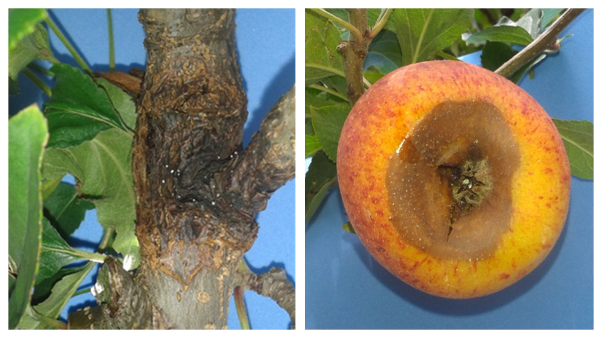
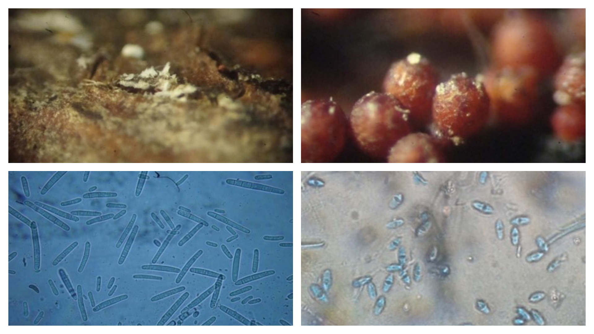

# Germinação de ascósporos e conídios e Monociclo em frutos

## Motivação

O Cancro Europeu das Pomáceas e Podridão de frutos causados por *Neonectria ditissima* ocorre em regiões produtoras de maçãs (*Malus domestica* Borkh.) do mundo todo, como Europa, América do Norte, Chile, Austrália, Nova Zelândia, Japão e África do Sul  [@Beresford2011]. Detectada no Brasil em 2002, se destaca entre as doenças que vêm causando grandes perdas na cadeia produtiva da macieira. A doença afeta os ramos e o tronco principal da planta causando sintoma de cancro, enquanto em frutos causa  podridão mole (Figura \@ref(fig:prancha01)). A podridão de Neonectria em frutos de maçã ocorre na maioria das áreas produtoras do mundo, e no Brasil sua elevada incidência pode ser explicada pelas condições climáticas mais favoráveis e/ou pela maior quantidade de inóculo nos pomares, devido à falta de experiência no manejo [@EmbrapaCancro2015].

(ref:prancha01) Sintomas de Cancro Europeu em macieira (esq.) e de podridão de Neonectria em fruto (dir.) em cultivar Gala.

```{r prancha01, echo = FALSE, fig.cap = '(ref:prancha01)'} 

```


O fungo produz dois tipos de esporos, sendo os ascósporos produzidos sexuadamente em peritécios e os conídios produzidos assexuadamente em esporodóquios (Figura \@ref(fig:prancha02)). Os dados disponíveis sobre as taxas de germinação de ascósporos em diferentes temperaturas vão até um período de oito horas [@Latorre2002] e devem ser complementados. A comparação entre a germinação de ascósporos e conídios em diferentes temperaturas e períodos de incubação é relevante para a predição de riscos de acordo com o esporo predominante no pomar. 

(ref:prancha02) Esporodóquio produzindo conídios (esq.) e peritécios produzindo ascósporos (dir.) de *Neonectria ditissima*.

```{r prancha02, echo = FALSE, fig.cap = '(ref:prancha02)'} 

```


Embora *N. ditissima* seja mais comumente descrito como patógeno da macieira, a pera (*Pyrus communis* L.) também é hospedeira [@Flack1977] e, ocasionalmente, os pomares de pera apresentam alta incidência da doença [@Weber2014]. Os pomares de pera são comumente plantados próximos aos pomares de maçã devido à semelhança entre os requisitos de horas de frio e tratamentos culturais, o que pode representar risco caso a doença chegue aos pomares de pereira e estes sejam suscetíveis. Não há nenhum relato científico recente sobre a podridão de frutos por Neonectria sobre pera, e o monociclo da doença nesse fruto nunca foi elucidado. 

Esse capítulo objetivou a elucidação e comparação de modelos polinomial e beta-monomolecular para avaliação de dados de germinação de conídios e ascósporos em diferentes temperaturas e períodos de molhamento, bem como descrever equações que descrevam o comportamento do monociclo da podridão de Neonectria em frutos de pera e maçã.


## Germinação de conídios e ascósporos

Temperaturas de 12 a 35 graus com períodos de incubação de 3 a 60 horas.

A Tabela \@ref(tab:germinacao-neonectria-ditissima) descreve como os dados da germinação de *Neonectria ditissima* foram tabulados. 

(ref:germinacao-neonectria-ditissima) Descrição do tipo de esporo (ascósporo ou conídio), temperatura (°C), período de incubação (h) e germinação (%).


```{r germinacao-neonectria-ditissima, echo=FALSE}
knitr::kable(head(iris), caption = '(ref:germinacao-neonectria-ditissima)',
             digits = c(NA, 0, 0, 1, 1),
             align = c("ccccc"),
             row.names = FALSE)
```

