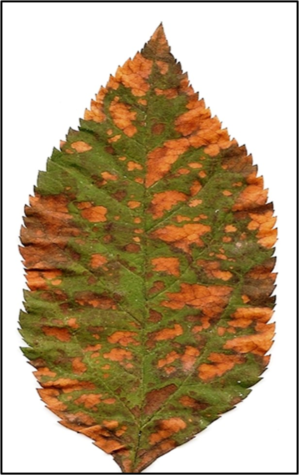
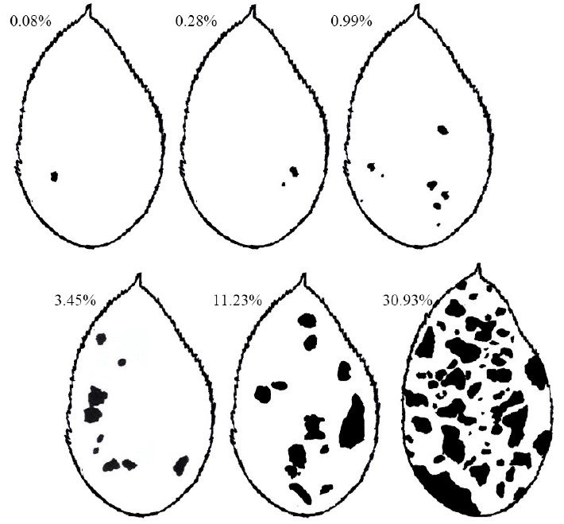

# AJUSTE DE MODELOS PARA O PROGRESSO TEMPORAL DA MANCHA FOLIAR DE GLOMERELLA (MFG)

## Motivação

O estudo do progresso temporal de doenças é muito útil para os produtores, pois fornece informações indiretas sobre o inóculo inicial presente no pomar e sobre a taxa de crescimento da epidemia, direcionando estratégias de controle. A curva de progresso da doença em plantas e a modelagem estatística podem facilitar a interpretação dos dados coletados em campo [@madden2007study]. No entanto, o uso de diferentes metodologias de análise pode fornecer diferentes interpretações do mesmo fenômeno biológico. Como é muito comum em estudos de campo, a variabilidade dos resultados não ocorre por acaso, mas pela combinação de diferentes fatores edafoclimáticos e de manejo, as estimativas de variabilidade fornecidas por modelos específicos podem ser particularmente importantes para a interpretação dos dados coletados [@molenberghs2001review].O objetivo deste capítulo será descrever a curva de progresso de epidemias, comparando duas abordagens de análise estatística. Exemplificaremos com dados de progresso da severidade da mancha foliar de Glomerella (MFG), cujo agente causal são espécies do fungo *Colletotrichum* spp. Sintomas da MFG podem ser visualizados na Figura \@ref(fig:mfg). 

(ref:mfg) Sintomas da mancha foliar de Glomerella na cultivar Gala.


```{r mfg, echo = FALSE, fig.cap = '(ref:mfg)'} 

```

## Delineamento experimental e curva do progresso da mancha foliar de Glomerella

Os dados de progresso temporal da mancha foliar de Glomerella (MFG) foram obtidos em trinta amostras de plantas escolhidas ao acaso, e em cada planta foi avaliado um ramo localizado no terço médio da planta contendo 10 folhas. A incidência e severidade da MFG e o número de folhas foram avaliados semanalmente até que todas as folhas tivessem caído. Para a incidência, foi calculada a porcentagem de folhas com algum sintoma da doença em relação ao número total de folhas. Para as avaliações de severidade, a escala diagramática desenvolvida por @kowata2010glomerella (\@ref(fig:escala)) foi utilizada para determinar a porcentagem de área foliar lesionada de cada folha. As avaliações começaram em dezembro de 2012 e terminaram em março de 2013.

(ref:escala) Escala diagramática para avaliação da severidade da mancha foliar de Glomerella.


```{r escala, echo = FALSE, fig.cap = '(ref:escala)'} 

```

## Análise de dados

Para o ajuste da curva de progresso da doença, consideramos o modelo logístico na parametrização centrada:


$$
f(x)=\frac{A}{1+exp\{\frac{I+t}{XS}\}{}'}
$$

onde $t$ é o tempo, A representa a assíntota (o valor máximo da doença quando o tempo tende ao infinito), $I$ é o ponto de inflexão (um valor no tempo onde a curva tem sua taxa máxima), e $XS$ é o parâmetro de escala que é inversamente proporcional à taxa no ponto de inflexão ($T$), que é precisamente $XS = A / (4T)$.

Para efeito de comparação, foram consideradas duas especificações do modelo. O primeiro, comumente adotado e denominado ingênuo, ajustou o modelo logístico aos dados com as seguintes especificações:


$$
y_{tij}=A\cdot (1+exp\{\frac{I-x_{t}}{XS}\})^{-1}+e_{tij}
$$

onde $y_{tij}$ é o valor observado da doença no momento $x_t$ na folha $j$ (j=1,2,…,10) do ramo $i$ (i=1,2,…,30) e $e_{tij}$ é o erro aleatório que é assumido para distribuição normal de média 0 e variância constante $σ_e^2$. Esta especificação ignora o efeito de ramos e folhas no ramo.

Dada a estrutura multinível, espera-se que haja variação na intensidade de doença entre os ramos, que é causada por fatores locais (temperatura, umidade, altura, solo, exposição ao sol), sendo que dentro do mesmo ramo pode haver variações devido à posição e idade.

Com base na estrutura multinível, é possível considerar uma modificação do modelo logístico com inclusão de efeitos aleatórios para acomodar a variância entre os ramos e as folhas. O maior modelo específico para esses dados é o modelo de efeito de ramo e folha para todos os parâmetros da curva:


$$
y_{tij}=(A+a_{i}+a_{i(j)})\cdot (1+exp\{\frac{(I+u_{i}+u_{i(j)})-x_{t}}{(XS+s_{i}+s_{i(j)})}\})^{-1}+e_{tij}
$$

onde $a_i$, $u_i$ e $s_i$ foram os desvios no ramo $i$, inflexão e escala, e $a_{i(j)}$, $u_{i(j)}$ e $s_{i(j)}$ foram os desvios na folha $j$ do ramo $i$. É assumido que os vetores de efeito aleatório $b$ e $c$ têm distribuição multivariada normal do vetor zero e matriz de covariância $Σ_b$ e $Σ_c$


$$
b^{\top }=[a_{i},u_{i},s_{i}]\sim N(0,Σ_b)
$$


$$
c^{\top }=[a_{i(j)},u_{i(j)},s_{i(j)}]\sim N(0,Σ_c)
$$

onde os efeitos em $b$ são independentes dos efeitos de $c$, e ambos são independentes do erro $e_{tij}$. 

O modelo de efeitos aleatórios foi ajustado aos dados pelo método de máxima verossimilhança com a função nlme do pacote nlme [@pinheiro2006nlme]. O modelo sem efeitos aleatórios foi ajustado com a função nls do pacote stats [@team2013r]. A escolha do modelo mais adequado para representar a curva de progresso da doença foi feita pelo valor de log-likelihood, onde o melhor ajuste (e teoricamente o melhor modelo) tem um valor maior de log-likelihood. 


A Tabela \@ref(tab:leaf_spot) descreve como os dados de severidade da MFG foram tabulados. 

(ref:leaf_spot) Identificação do pomar - pomar, dias após o início das avaliações - dia (tempo em dias), ramo marcado em uma árvore ao acaso - ramo, folha numerada de 0 a 10 em cada ramo - folha e severidade da MFG em cada folha - sever (%).


```{r leaf-spot, echo=FALSE}
tb <- read.csv2 ("leaf_spot.csv")
knitr::kable(head(tb), caption = '(ref:leaf_spot)',
             digits = c(0, 0, 0, 0, 2),
             align = c("ccccc"),
             row.names = FALSE)
```

Os tópicos a seguir testarão ajustes de modelos não lineares para descrever o progresso da MFG


```{r}
#Definições da sessão.
library(devtools)
library(lattice)
library(latticeExtra)
library(plyr)
library(rootSolve)  # gradient().
library(wzRfun)     # panel.cbH().
```

```{r}
#Importando os dados
leaf_spot  <-  read.csv2('leaf_spot.csv', header=T, dec=",")
```

```{r}
# Estrutura dos dados.
str(leaf_spot)

# Tabela de frequencia.
ftable(xtabs(~pomar + dia, data = leaf_spot))

# Tabela de frequência de folhas presas ao ramo (sem folhas perdidas).
ftable(xtabs(~pomar + dia, data = na.omit(leaf_spot)))

# Convertendo variáveis para fator.
leaf_spot <- within(leaf_spot, {
  pomar <- factor(pomar, labels = c("I"))
  ramo <- factor(ramo)
  folha <- interaction(ramo, folha, drop = TRUE)
})
```

```{r}
#Gráfico exploratório
xyplot(sever ~ dia | ramo,
       groups = folha,
       data = subset(leaf_spot, pomar == "I"),
       type = "o",
       xlab = "Dia de avaliação",
       ylab = "Severidade da mancha foliar (%)",
       main = "Pomar I",
       as.table = TRUE)
```

```{r}
da <- subset(leaf_spot, pomar == "I")
```

### Ajuste do modelo logístico sem efeitos aleatórios


```{r}
# Calibrando o chute inicial.
start <- list(A = 80, I = 80, S = 20)
xyplot(sever ~ dia, data = da) +
  layer(panel.curve(A/(1 + exp(-(x - I)/S)), col = 2),
        data = start)

n0 <- nls(sever ~ A/(1 + exp(-(dia - I)/S)),
          data = da,
          start = start)
```

```{r}
# Diagnóstico
m0 <- as.lm(n0)
par(mfrow = c(2, 2))
plot(m0)

layout(1)

# Estimativas.
summary(n0)

# Taxa no ponto de inflexão.
coef(n0)["A"]/(4 * coef(n0)["S"])

#valor de log-likelihood, onde o melhor ajuste tem um valor maior de log-likelihood
logLik(n0)
```

```{r}
# Resultado do ajuste.
xyplot(sever ~ dia, data = da) +
  layer(panel.curve(A/(1 + exp(-(x - I)/S)), col = 2),
        data = as.list(coef(n0)))
```

### Ajuste do modelo logístico com efeitos aleatórios

Essa é a abordagem "naive" pois não considera a existência do efeito de plantas (blocos). O efeito de planta é misturado com o desvio residual. Isso tem influência no valor estimado dos parâmetros e sobretudo no tamanho do erro padrão deles.

```{r}
#Carregando o pacote que tem a função nlme
library(nlme)
```

```{r}
da <- da[complete.cases(da), ]
da <- groupedData(sever ~ dia | ramo/folha,
                  data = da,
                  order.groups = FALSE)

n1 <- nlme(sever ~ A/(1 + exp(-(dia - I)/S)),
           fixed = A + I + S ~ 1,
           random = I + S ~ 1 | ramo/folha,
           data = da,
           start = coef(n0))
```

```{r}
# Estimativas.
summary(n1)

# Taxa no ponto de inflexão.
fixef(n1)["A"]/(4 * fixef(n1)["S"])

#valor de log-likelihood, onde o melhor ajuste tem um valor maior de log-likelihood
logLik(n1)
```

```{r}
# Resultado do ajuste.
plot(augPred(n1, level = 0), as.table = TRUE)
```

```{r}
# Estimativas e standard error.
summary(n0)$coeff

summary(n1)$tTable
```

```{r}
# Confidence intervals.
ci0 <- cbind(confint.default(n0), coef(n0))
ci1 <- intervals(n1)$fixed

ci1 <- ci1[, c(2, 1, 3)]
ci0 <- ci0[, c(3, 1, 2)]
colnames(ci0) <- colnames(ci1) <- c("est", "lwr", "upr")

ci <- as.data.frame(rbind(ci0, ci1), row.names = FALSE)
ci$par <- factor(c("A","I","S","A", "I", "S"), levels = c("A", "I", "S"))
rownames(ci) <- NULL
ci$model <- gl(2, 3, labels = c("nls", "nlme"))
ci

segplot(model ~ lwr + upr | par,
        data = ci,
        centers = est,
        draw = FALSE,
        scales = list(x = "free"),
        layout = c(NA, 1),
        ylab = "Modelo",
        xlab = "Estimativa com IC de 95%")
```

```{r}
# Predição.

# Domínio para a predição.
pred <- expand.grid(dia = 0:85)

# Valores preditos.
pred$y0 <- predict(n0, newdata = pred)
pred$y1 <- predict(n1, newdata = pred, level = 0)

# Modelo escrito como função dos parâmetros (theta).
f <- function(theta, xx) {
  with(as.list(theta),
       A/(1 + exp(-(xx - I)/S)))
}
```

```{r}
# Matriz com as derivadas parciais de theta no mle de theta.
F0 <- gradient(f, x = coef(n0), xx = pred$dia)
F1 <- gradient(f, x = fixef(n1), xx = pred$dia)

# Fatoração da matriz de covariância de theta.
U0 <- chol(vcov(n0))
U1 <- chol(vcov(n1))

pred$se0 <- sqrt(apply(F0 %*% t(U0), 1, function(x) sum(x^2)))
pred$se1 <- sqrt(apply(F1 %*% t(U1), 1, function(x) sum(x^2)))

zval <- qnorm(p = c(lwr = 0.025, fit = 0.5, upr = 0.975))
me <- outer(pred$se0, zval, "*")
b <- sweep(me, 1, pred$y0, "+")
colnames(b) <- paste(colnames(b), "0", sep = "")
pred <- cbind(pred, b)

me <- outer(pred$se1, zval, "*")
b <- sweep(me, 1, pred$y1, "+")
colnames(b) <- paste(colnames(b), "1", sep = "")
pred <- cbind(pred, b)
```

```{r}
# Predição para o nível de folha.

predue <- unique(subset(da, select = c(ramo, folha)))
dia <- seq(0, 85, by = 2)
predue <- predue[rep(1:nrow(predue), each = length(dia)), ]
predue$dia <- dia
str(predue)

a <- predict(n1, newdata = predue, level = 2)
predue$y <- unlist(a)
```

```{r}
#Gráfico comparativo do ajuste dos modelos

col <- 4
lwd <- c(1,1.5)
lty <- c(2,1)
nomes <- c("nls","nlme")

xyplot(sever ~ dia,
       data = da,
       jitter.x = TRUE,
       pch = 19,
       ylab = "Severidade da mancha foliar (%)",
       xlab = "Dia da avaliação", col=col, lty=lty[2], lwd=lwd[2],
       key=list(columns=2,
           lines=list(lwd=lwd, col=col, lty=lty),
           text=list(nomes))) +
  as.layer(xyplot(y ~ dia,
                  data = predue,
                  col = "gray50",
                  type = "l",
                  groups = folha), under = TRUE) +
  as.layer(xyplot(y0 ~ dia,
                  data = pred,
                  type = "l",
                  lty = 2,
                  lwd = 2,
                  prepanel = prepanel.cbH,
                  cty = "bands",
                  ly = pred$lwr0,
                  uy = pred$upr0,
                  fill = "red",
                  alpha = 0.6,
                  panel = panel.cbH)) +
  as.layer(xyplot(y1 ~ dia,
                  data = pred,
                  type = "l",
                  lty = 1,
                  lwd = 2,
                  prepanel = prepanel.cbH,
                  cty = "bands",
                  ly = pred$lwr1,
                  uy = pred$upr1,
                  fill = "blue",
                  alpha = 0.6,
                  panel = panel.cbH))
```


## Resultados e conclusões

Os diagramas que representam o progresso da severidade da MFG em cada folha mostram que houve muita variabilidade entre as folhas do mesmo ramo, assim como entre os ramos de uma mesma planta. O número de observações de cada folha também variou ao longo do tempo, uma vez que as folhas caíram em tempos diferentes, demonstrando que não só a severidade da MFG é dependente de vários fatores, mas a desfolha também. De acordo com o valor de log-likelihood, o modelo mais adequado para representar a curva de progresso da MFG foi o modelo logístico não linear com efeitos aleatórios quando comparado ao modelo logístico não linear com efeitos fixos.

O modelo logístico com efeitos aleatórios teve um melhor ajuste, pois considera a estrutura multinível dos dados. A variabilidade observada entre as folhas de um mesmo ramo e entre os ramos de uma mesma planta sugere que a forma como a MFG se manifesta depende de características locais como nutrição da planta, condições do solo, exposição solar, aspectos fisiológicos, entre outros. Segundo @molenberghs2001review, os modelos não lineares com efeitos fixos assumem que a variabilidade entre as plantas ocorre apenas por acaso e ignoram a heterogeneidade entre elas.

Os parâmetros que representam a assíntota máxima ($A$) e o ponto de inflexão ($XC$) diferiram significativamente entre os dois modelos testados. A assíntota máxima foi de 35,91% para o modelo de efeitos fixos e 49,47% para o modelo de efeitos aleatórios. O ponto de inflexão foi de 55,54 dias para o modelo de efeitos fixos e de 59,08 dias para o modelo de efeitos aleatórios. O parâmetro de escala ($sc$) não diferiu significativamente entre os modelos testados e foi de 9,62 e 9,22 para o modelo de efeitos fixos e o modelo de efeitos aleatórios, respectivamente. 

O modelo logístico não linear com efeitos aleatórios, mais adequados para representar a evolução da MFG em campo, incorporou parte da heterogeneidade entre as plantas, gerando resultados com maior intervalo de confiança. Nesse modelo, as estimativas da assíntota máxima e da taxa de infecção são maiores, o que indica que a doença é mais agressiva do que a considerada por outros modelos. O resultado desta análise é um alerta aos técnicos e produtores quanto ao controle da MFG, que não deve levar em conta apenas a pulverização com fungicidas, mas também a utilização de medidas adicionais. O plantio adensado de plantas já se mostrou favorável à severidade de MFG [@hamada2019pathogen] e outros aspectos como poda, fertilização e irrigação devem ser investigados em trabalhos futuros. Além disso, o resultado desta análise é um alerta para o controle do inóculo primário desde o inverno, uma vez que o inóculo sobrevive nas plantas e nas folhas caídas no solo [@hamada2017survival], sendo esta etapa primordial para reduzir a curva de progresso da MFG e evitar epidemias. Informações detalhadas sobre o experimento relacionado a esta análise podem ser encontradas em @moreira2020comparative.

## Referências