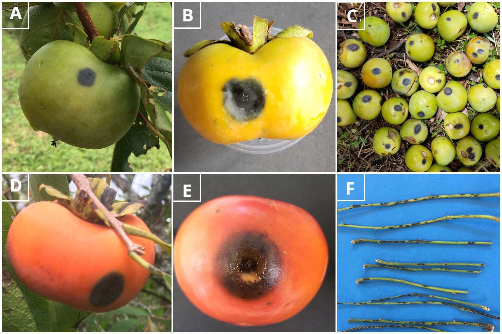

# Análise de sobrevivência em esquema fatorial relacionando diferentes espécies com eficiência de fungicidas em frutos destacados 

```{r, echo = FALSE, results = "asis"}
chapter_authors(c("Thiago de Aguiar Carraro", "Paulo dos Santos Faria Lichtemberg", "Camilla Castellar", "Walmes Marques Zeviani", "Louise Larissa May De Mio"))
```

O caqui (*Diospyros kaki* L.) é uma fruta de alto valor nutricional e se aclimata muito bem em regiões de clima temperado e subtropical. O Brasil, é o quinto maior produtor e sua produção está concentrada nos estados de São Paulo, Rio Grande do Sul, Paraná e Minas Gerais [@fao2017]. Nos últimos anos, a produção de caqui vem sofrendo uma grande queda da produção, decorrente em parte, da antracnose.

A antracnose, causada por *Colletotrichum* spp., é uma doença severa que pode infectar ramos, folhas e frutos, que veem ocasionando sérias perdas aos produtores, devido a queda prematura dos frutos e da alta incidência da doença na pré-colheita. O principal agente causal é o fungo *Colletotrichum horii*, entretanto recentemente foram relatadas outras espécies patôgenicas ao caquizeiro [@maydemio2015; @blood2015]. As espécies *C. fructicola*, *C. nymphaeae* e *C. melonis* foram relatadas também como causadores de antracnose em caquizeiro no Brasil [@carraro2019] (Figura \@ref(fig:prancha-1)).

(ref:prancha-1) Lesões necróticas, deprimidas, escuras e circulares em frutos imaturo no campo (A), evolução do sintoma em fruto imaturo destacado (B), e a acentuada queda prematura dos frutos de caquizeiro (C). Lesões em frutos maduros no campo (D) e destacado (E)(com massa de conídios no centro da lesão). Lesões típicas de antracnose em ramos jovens (F).

```{r prancha-1, echo = FALSE, fig.cap= '(ref:prancha-1)'}

```

O controle químico é uma das formas mais eficientes para o controle de doenças de plantas, porém para o caquizeiro tem-se poucos produtos registrados no Brasil, dentre estes produtos mais de 60% apresentam riscos de médio a alto para o desenvolvimento de resistências do fungo à fungicidas (DMI e QoI) e, consequentemente podem resultar em uma perda da eficiência em campo, caso os mesmos não sejam adequadamente manejados. Para adotar estratégias de controle eficientes ao longo das safras é necessário que seja realizado o monitoramento da sensibilidade do fungo aos fungicidas.

Em estudos iniciais de monitoramento da sensibilidade de *Colletotrichum* spp. aos fungicidas registrados para o caquizeiro, foi observado uma sensibilidade alterada para os ingredientes ativos dos grupos QoI e DMI, os quais ainda nem estão registrados para antracnose, apenas para cercosporiose. Com as novas espécies do fungo *Colletotrichum* causando a doença, torna-se importante o entendimento da interação patógenos/fungicidas, para observar se existe diferenças no controle, diante disso adotar estratégias de manejo considerando sensibilidade inerente e eficiência dos fungicidas. Somado a isso, o manejo do número de aplicações por safra alternando grupos químicos e incluindo fungicidas de amplo espectro são importantes para evitar sobreposição de populações menos sensíveis, o que dificultará no manejo da doença.

## Metodologia...(*ex vivo*)

Ensaios *ex vivo* são também muito relevantes para determinar se está ocorrendo uma resistência prática, ou seja, quando ocorre uma falha do controle da doença em campo [@ghinirekimatih2000]. Estes testes podem ser realizados com plantas ou partes vegetais destacados, o qual serão tratados com a concentração recomendada para o produtor.


Para as análises das eficiências de controle dos fungicidas considerando os tempos para ocorrência dos primeiros sintomas e sinais em frutos destacados inoculados com diferentes espécies de *Colletotrichum* serão avaliadas por intermédio da análise de sobrevivência...


Discutir ANÁLISE DE SOBREVIVÊNCIA PARA ESSE TIPO DE EXPERIMENTO!!!